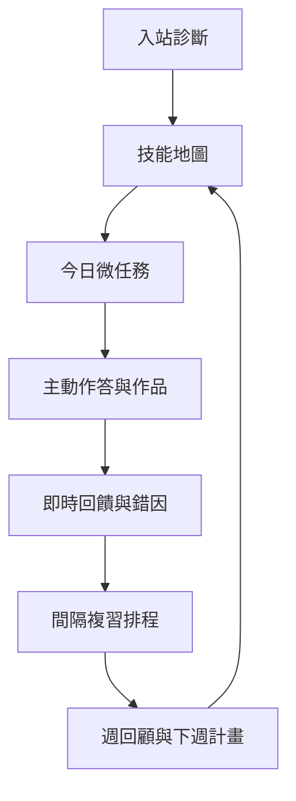
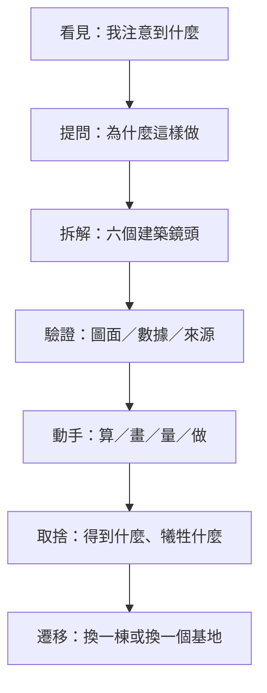
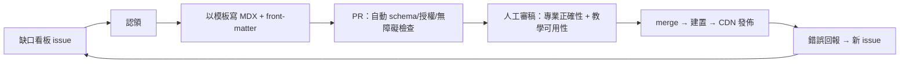
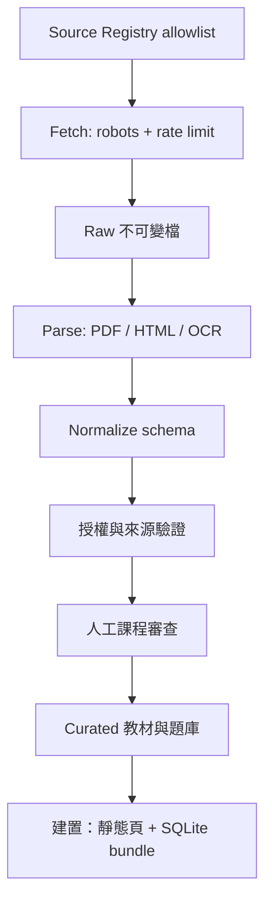

# Arch V4 — 台灣高工建築科學習、建築素養與志向養成平台

> **給 CODE Agent 的產品／內容／視覺／技術總規格（V4.0）**
> 最後更新：2026-08-03｜語言：繁體中文（台灣）｜取代 V3.0
> Canonical repository：[`https://github.com/waatax/Arch`](https://github.com/waatax/Arch)
> 本檔為**唯一事實來源（single source of truth）**。與程式碼衝突時，先修本檔再修程式碼。
> 可執行交付順序、現況與 issue-ready backlog：[`docs/implementation-plan.md`](docs/implementation-plan.md)。

---

## V4 發布摘要

V4 將 V3 規格正式落地為可發布的完整學習網站：13 科、82 個章節均具概念教材、練習與詳解；每章配置 OpenAI 生成的核心觀念圖解，公式以「視覺關係＋精確 HTML 文字」雙層呈現；全站完成 320–1440 px 響應式、手機觸控、寬表格與長公式處理，並加入內容完整度驗證、課程覆蓋 registry、SQLite schema 與 GitHub Pages 靜態部署契約。

V3 以下各節保留為 V4 的產品與架構基線；若與本摘要及現行程式碼衝突，以 V4 實作、`docs/implementation-plan.md` 與自動驗證結果為準。

---

## 0. v2.0 → v3.0：從「有效學習」升級為「想成為建築人」

### 0.1 v3 核心升級

| 面向 | v2.0 | v3.0 |
| --- | --- | --- |
| 產品核心 | 公共知識站＋個人教練 | 再加入**台灣建築探索、設計工作室與生涯志向**，形成「會考、會做、會看、想繼續走」四位一體 |
| 建築素養 | P2 延伸內容，核心學科完成後才做 | **跨科動機層**；從第一個版本起，每週、每科都由真實建築與設計問題帶入 |
| 視覺美學 | 僅有可及性與設計 token 原則 | 完整的 **Architectural Editorial Design System**：色彩、字體、網格、攝影、圖解、動態、元件與視覺 QA |
| 案例內容 | 建築素養主題樹，缺少落地格式 | **Taiwan Architecture Case Lab**：核心案例、六鏡頭閱讀法、案例任務、現地觀察與課綱交叉連結 |
| 趣味機制 | 微任務與工作室 | 加入建築護照、設計抉擇、圖層解密、現地任務；以能力證據解鎖，**不使用排行、扣點或焦慮式連勝** |
| 志向養成 | 升學資料與作品集 | 每個案例顯示完整專業團隊，連到建築師、結構、營造、測量、BIM、材料與永續等職涯角色 |
| 技術落點 | 抽象 monorepo 與 CDN，可有 ISR／API | 唯一倉庫固定為 **`waatax/Arch`**；GitHub Actions 建置，GitHub Pages 靜態發布，所有核心功能必須靜態／裝置端可運作 |
| 內容資產 | SQLite 分片與 `raw/` 皆在同一構想中 | 明確區分 Git 可追蹤原始碼、Release 資產與不入 Git 的可重建原始資料，受 GitHub Pages 1 GB 發布限制約束 |
| 成功定義 | 找得到、學得會、持續使用 | 再加入「**願意多看一棟、願意完成一件作品、能說出想走的方向**」的興趣與志向證據 |

> v2 的核心資產（學習科學閉環、來源分級治理、反羞辱設計、可重現的無 LLM 引擎、公共骨幹＋學校 overlay）**全部保留**。v3 改的是學生進站的情緒起點：不是先告訴他哪裡不會，而是先讓他發現「原來建築值得我學會」。

### 0.2 v3 修正的關鍵缺陷

| # | v2 問題 | v3 處置 |
| --- | --- | --- |
| V3-D1 | 建築素養被排到 P2，難以承擔引發興趣的角色 | 改為全站跨科入口與 P1 垂直切片；每個核心技能至少連一個真實案例 |
| V3-D2 | 沒有可實作的質感美學規格 | 新增 §4.7–§4.13：設計方向、token、字體、版面、影像、動態、元件與 QA |
| V3-D3 | 「台灣建築」只有主題名稱，缺內容模板與任務 | 新增 §6.7–§6.14：案例實驗室、核心案例矩陣、六鏡頭、任務弧、現地學習與資料 schema |
| V3-D4 | 只講建築師，可能強化「天才設計師」迷思 | 每案強制呈現跨專業 credit map 與職涯入口，讓學生看見多種可達成的志向 |
| V3-D5 | `ISR`、動態 API 與 GitHub Pages 靜態主機衝突 | 移除核心路徑的伺服器依賴；`output: 'export'`，查詢、排程、紀錄與搜尋皆在裝置端執行 |
| V3-D6 | 大量 PDF、OCR、圖片與 SQLite 可能撐爆 Git／Pages | 新增資產分層、尺寸預算、Release bundle 與 hash manifest；發布站硬上限設為 900 MB 警戒 |
| V3-D7 | 趣味只停留在「遊戲化」名詞 | 改為「好奇問題 → 解密 → 動手 → 遷移 → 展示」可驗收的任務弧，不以虛擬點數代替學習 |
| V3-D8 | 無法量測學生是否真的更想學建築 | 新增興趣、價值、職涯清晰度與自發探索的低壓證據指標 |
| V3-D9 | 缺少完整視覺回歸與學生美感測試 | 新增 375／768／1440 px 截圖閘門、視覺 rubric、5 秒測試與目標學生共評 |
| V3-D10 | 未指定實際開發治理位置 | 所有 issue、PR、ADR、內容與部署唯一歸屬 `waatax/Arch`，另定 branch protection 與 CODEOWNERS |

### 0.3 v3 迭代狀態

依專案負責人 2026-08-03 最新指示，本次先完成第 1–5 輪並交付 v3；原規劃第 6 輪「風險／治理深審」與第 7 輪「CODE Agent 全文一致性審計」暫緩，留待後續版本執行。下表不得被解讀為第 6、7 輪已完成。

| 輪次 | 審核鏡頭 | 本版實質改動 | 通過條件 |
| --- | --- | --- | --- |
| 1 | 產品策略 | 重寫北極星與優先序，建築素養由延伸改為動機層 | 「考試、實作、素養、志向」皆有可測成果 |
| 2 | 學習科學 | 將興趣四階段、自我決定、提取、間隔、worked example 變成產品規則 | 每項方法論都有觸發點、介面行為與禁忌 |
| 3 | 建築教育 | 建立台灣核心案例矩陣、六鏡頭與案例任務 | 案例不可只是相簿；必須連回技能、考點、作品與職涯 |
| 4 | 設計品質 | 建立完整視覺語言、元件狀態與攝影／圖解規範 | 能由 token 與頁面規格直接實作，且符合 WCAG 2.2 AA |
| 5 | 工程落地 | 對齊 `waatax/Arch`、Next.js 靜態匯出與 GitHub Pages | 無伺服器仍能完成所有 P0–P3 核心流程 |
| 6 | 風險與治理 | **本次依指示跳過**；既有 v2 基線與本輪新增規則保留，但尚未做獨立深審 | 後續執行 |
| 7 | CODE Agent 執行 | **本次依指示跳過**；尚未做逐條全文一致性與 issue-ready 審計 | 後續執行 |

### 0.4 事實查核紀律（強制）

本檔所有標記 `【待查核】` 之處，CODE Agent **必須在實作前以當年度官方公告核對**，並將結果寫入 `data/registry/facts.yml`（含來源 URL、查核日、下次查核日）。**禁止把任何招生、考綱、證照、學校名單硬編碼成永久事實。**

已於 v1 查核並沿用之事實（仍需年度複查）：

- 115 學年度四技二專統測**土木與建築群**共同科目為國文、英文、數學 C；專業科目（一）為基礎工程力學、材料與試驗；專業科目（二）為測量實習、製圖實習。([統測考科](https://www.tcte.edu.tw/index.php?mod=TVETest%2Finfo4y)、[專一大綱](https://www.tcte.edu.tw/doc/115Range_4y/115-4y-06-1-range.pdf)、[專二大綱](https://www.tcte.edu.tw/doc/115Range_4y/115-4y-06-2-range.pdf))
- 校系條件逐年變動，僅能保存「快照＋來源＋查核日」。([技專校院招生資訊](https://www.techadmi.edu.tw/))
- 台中高工建築科教學場域含製圖、建築實習、電腦繪圖、設計技術、測量儀器、材料試驗。([建築科官方頁](https://tcivs.tc.edu.tw/p/412-1081-9786.php?Lang=zh-tw))

---

## 1. 北極星與範圍

### 1.1 一句話產品定義

**Arch 是全台高工建築科學生的公共學習資料庫、台灣建築探索館與個人學習教練**：任何人不必登入，就能從一棟真實建築或一個考點開始，看懂設計、學會概念、練一題、動手做一件小作品；裝置端個人教練再把弱點、興趣與升學目標編成可完成的每日路徑，帶學生由「我可能不會」走到「我能做出來，而且我想成為其中的一員」。

**v3 的核心成長循環**：

```text
被一棟建築吸引 → 提出「為什麼」 → 學一個必要概念 → 解一道題／畫一張圖
→ 做一次小實驗 → 說出設計取捨 → 留下一件能力證據 → 看見一種職涯可能
```

其中「漂亮」不是裝飾層；美感必須幫助學生注意結構、材料、光、尺度、動線與環境之間的關係。任何只追求視覺驚豔、卻增加認知負荷或遮蔽學習主體的設計，均不採用。

### 1.2 使用者分層

| 角色 | 人數量級 | 核心任務 | 是否需登入 |
| --- | --- | --- | --- |
| **訪客／搜尋而來的學生** | 最大宗 | 「這題怎麼解」「三角比是什麼」「製圖線型有哪些」 | 否，全站內容可讀可練 |
| **常規學生**（核心） | 主要留存 | 每日微任務、錯題回補、作品歷程、升學規劃 | 是（本機帳號即可） |
| **教師／科主任** | 少數但高槓桿 | 指派練習、看班級概念熱點、貢獻教材 | 是，需學校驗證 |
| **貢獻者**（學長姐／教師／志工） | 少數 | 補內容缺口、回報錯誤、審稿 | 是，需簽 CLA |
| **家長／監護人** | 被動 | 未成年同意、選擇性檢視摘要 | 是，經學生逐項授權 |

**設計順位：學生 > 教師 > 貢獻者。** 任何為教師或管理端增加的功能，若會讓學生感到被監控或被比較，一律不做（見 §10.4）。

### 1.3 服務範圍：科別與需求

**主要對象**：全台設有建築科之高工／高職（【待查核】以教育部技職校院資訊為準，數量級約 20–30 校，須以 `data/registry/schools.yml` 資料驅動，禁止硬編碼）。

**同群相容科別**（共用專業科目一／二，內容可重用）：土木科、空間測繪科、消防工程科【待查核群內科別清單】。

**跨群需求**（僅索引與導讀，不列為主線）：欲跨考設計群／室內設計相關科系者。

### 1.4 北極星與成功定義

| 層級 | 指標 | 12 個月健康判準 |
| --- | --- | --- |
| **北極星** | **每週完成 ≥3 次「有效建築學習循環」的學生數**（有效＝看見真實情境＋主動作答／實作＋回饋＋至少一次延遲後正確或修正版） | 持續成長，且延遲後正確率 ≥60% |
| 覆蓋 | 統測四考科技能樹的**最小內容包完成率** | 專一／專二 ≥90%、數學 C ≥80%、國英 ≥60% |
| 可及 | **搜尋可達率**：隨機抽 100 個學生真實提問，站內可在 2 步內找到對應頁面 | ≥85% |
| 深度 | 註冊學生 4 週留存 | ≥35% |
| 品質 | 內容錯誤回報密度（每千次瀏覽） | 持續下降；嚴重錯誤 48 小時內修正 |
| 個人 | 12 週：能力地圖、每日 30–60 分鐘習慣、每科一輪弱點回補、可呈現作品 | 沿用 v1 |
| 興趣 | 自主點開非指定案例、收藏問題、完成建築觀察或主動延伸任務 | 8 週內至少 60% 試用者出現 2 種以上自發探索證據 |
| 志向 | 能說出至少 2 個有興趣的建築相關角色，並指出自己已有／待補的能力證據 | 12 週內完成一張「我的建築方向圖」，不要求單一職涯定案 |
| 美感 | 學生能以至少 3 個具體詞彙描述案例（如比例、光影、材料、動線），而非只回答「好看／不好看」 | 案例任務後的具體描述詞數與理由品質提升 |

### 1.5 產品原則（v1 七條 ＋ v2 五條）

**沿用（不可違反）**

1. **先成功、再加量**：首次任務 5–10 分鐘可完成。
2. **只呈現下一步**：每次最多 1–3 件事。
3. **診斷不是貼標籤**：只顯示「尚未穩定」與前置技能，禁止笨／差／落後字眼。
4. **理解、提取、回饋、間隔複習**：看懂不是學會。
5. **建築要看得到、做得到**：抽象概念必配圖與構件情境。
6. **個人資料本機優先**：學習資料預設留在裝置，雲端同步為選配且端對端加密。
7. **隱私最小化**：未成年帳號需明確監護／學校同意流程。

**新增（v2 規模化所需）**

8. **免登入即可學**：任何內容頁在未登入狀態下必須完整可讀、可作答；登入只換取「記錄與個人化」。
9. **內容即程式碼**：所有 curated 內容以 Git 版本控管、可 diff、可回溯、可 PR 審稿。
10. **缺口要可見、可認領**：沒有內容的技能節點不隱藏，公開標示「缺口」並開放貢獻。
11. **公共骨幹、學校差異為 overlay**：核心內容不綁單一學校；各校軟體、進度、校訂科目以資料覆蓋層處理。
12. **靜態優先、AI 最後**：內容與練習不依賴推論成本；LLM 僅在受控環節輔助，離線與零 AI 情況下產品仍完整可用。

**v3 新增（美感、興趣與志向）**

13. **先讓人想看，再帶人看懂**：每個新單元以一個有張力的真實問題或局部影像開場，不以定義清單開場。
14. **建築沒有唯一漂亮答案，但有可檢驗的理由**：設計題允許多解；回饋依使用者、基地、結構、材料、環境與表達證據評估，不做審美判官。
15. **一棟建築，由一群人完成**：案例 credit 不只列建築師，必須呈現結構、機電、營造、工藝、景觀、聲學、測量、維運等角色；不神化單一大師。
16. **美感服務理解**：留白、層級、圖片與動態都必須降低搜尋成本、凸顯空間關係；禁止裝飾性 3D、無目的視差與搶注意力的粒子效果。
17. **興趣不是天生標籤**：依「被觸發 → 願意再看 → 主動探究 → 形成方向」提供不同支持；不以一次測驗判定學生適不適合建築。
18. **從台中出發、看見全台灣**：第一批現地任務優先服務台中學生，但案例骨幹需涵蓋北、中、南、東／離島、傳統／現代、公共／日常與新建／保存。
19. **證據勝過徽章**：解鎖必須來自草圖、解題、模型、觀察或說理；徽章只整理能力，不以點數、抽卡或稀缺獎勵操控使用。
20. **每週保留驚喜**：個人教練每週至少安排一次 10–20 分鐘、不以分數為主的案例探索或設計微任務；統測倒數仍不可完全取消。

---

## 2. 核心架構決策：雙平面（Dual-Plane）

### 2.1 要解的矛盾

「公共網站，人人找得到」與「Local-first，資料不出裝置」表面上互斥。v2 的解法是把系統切成兩個獨立平面，各自最佳化：

```mermaid
flowchart LR
  subgraph CP[Content Plane 內容平面 · 公開]
    A[Git 內容倉庫] --> B[建置：靜態頁 + SQLite bundle]
    B --> C[CDN 靜態發佈]
  end
  subgraph LP[Learner Plane 學習者平面 · 私密]
    D[瀏覽器 OPFS SQLite] --> E[本機規則引擎<br/>mastery/scheduler]
    E --> F[選配 E2EE 同步]
  end
  C -->|唯讀下載| D
  D -.->|不上傳作答內容.-> CP
```

### 2.2 兩平面的契約

| | Content Plane（內容平面） | Learner Plane（學習者平面） |
| --- | --- | --- |
| 內容 | 技能樹、教材、題目、詳解、考綱、校系快照 | 作答、錯題、掌握度、排程、作品、反思 |
| 位置 | CDN／靜態檔＋可下載 SQLite 分片 | 瀏覽器 OPFS／裝置本機 SQLite |
| 寫入者 | 編輯部與貢獻者（經 PR 審核） | 只有學生本人 |
| 版本 | 語意化版本＋內容 hash，可增量更新 | 逐筆時間戳，last-write-wins |
| 傳輸方向 | 單向：內容 → 裝置 | 預設不上行；同步為選配且客戶端加密 |
| 離線 | 已下載分片可完全離線 | 完全離線 |
| 成本 | 近乎零邊際成本（純靜態） | 零（跑在使用者裝置） |

**強制邊界**：伺服器**不得**接收學生的原始作答內容、作品圖片或反思文字。可上行的僅有去識別化的彙總事件（見 §11.3），且預設關閉、可退出。

### 2.3 決策紀錄（ADR 摘要）

| ID | 決策 | 主要理由 | 被否決的替代方案 |
| --- | --- | --- | --- |
| ADR-01 | 內容平面採**建置期靜態化**（SSG）＋ CDN | 免登入可讀、SEO 可索引、成本近零、易離線快取 | 全動態 SSR：成本高、離線難、SEO 無優勢 |
| ADR-02 | 內容以 **SQLite 分片 bundle** 下載至 OPFS | 一次下載即可離線全文檢索與出題，不必每台裝置跑 ETL | 逐題 API：離線失效；整包 JSON：體積失控 |
| ADR-03 | 個人資料**預設不上雲**，同步為 E2EE 選配 | 未成年個資風險最小化；符合原則 6 | 帳號制雲端 DB：法遵成本高、信任門檻高 |
| ADR-04 | 內容採 **content-as-code**（Git＋MDX＋PR） | 可審稿、可回溯、可多人協作、可自動驗證 | CMS 後台：審稿軌跡弱、難自動化驗證 |
| ADR-05 | ETL 只在**建置伺服器**執行，不在使用者裝置 | 抓取合規責任集中、rate limit 可控 | v1 的每機 ETL：多機重複抓取，違反禮貌爬取 |
| ADR-06 | 學習引擎為**純規則、可重現**，LLM 僅輔助 | 可測試、可離線、無推論成本、無幻覺風險 | LLM 驅動排程：不可重現、成本隨用戶線性成長 |

---

## 3. 需求全景：學生到底想在這裡找到什麼

v1 只覆蓋「統測四考科」。但題目要求是「**所有想學的資料都找得到**」——這需要先把需求攤開。

### 3.1 八大需求域

| 域 | 學生真實提問樣例 | 內容形態 | 優先序 |
| --- | --- | --- | --- |
| **A. 統測應試** | 「114 專一第 12 題怎麼算」「材料試驗會考什麼」 | 考綱、歷屆題、原創詳解、模考 | P0 |
| **B. 校內學科** | 「明天段考力學平衡」「木材含水率筆記」 | 概念卡、圖解、階梯練習 | P0 |
| **C. 製圖與實習** | 「剖面線怎麼畫」「圖框尺寸」「線型比例」 | 步驟示範、rubric、自評 | P0 |
| **D. 測量實習** | 「導線計算表怎麼填」「經緯儀整置步驟」 | 流程卡、計算範例、外業任務 | P0 |
| **E. 軟體技能** | 「AutoCAD 圖層怎麼設」「SketchUp 建模」「Revit 入門」 | 工具無關概念＋版本標註教學卡 | P1 |
| **F. 證照與競賽** | 「建築製圖應用丙級術科怎麼準備」「技藝競賽考什麼」 | 檢定簡章索引、術科流程、練習排程 | P1 |
| **G. 升學與生涯** | 「北科建築要幾分」「備審怎麼寫」「建築系在學什麼」 | 校系快照、備審素材庫、系所導覽 | P1 |
| **H. 建築素養與設計志向** | 「這棟建築為什麼這樣蓋」「我喜歡哪種空間」「哪些人一起完成它」 | 案例實驗室、六鏡頭解密、現地任務、職涯 credit map | **P0／P1 橫向層** |

> **證照類【待查核】**：與建築科相關之技術士職類與級別（如建築製圖應用等）須以勞動部勞動力發展署技能檢定中心當年度公告為準，寫入 `data/registry/certifications.yml`，不得憑記憶列舉。

### 3.2 覆蓋優先序原則

1. **P0 先建立 A–D 的課綱骨幹與 H 的案例資料模型**；兩者必須共享 `skill_id`，不得分成考試站與漂亮相簿兩座孤島。
2. **P1 以一條完整垂直切片證明價值**：一棟台灣建築 → 一個核心概念 → 一題統測／原創題 → 一次微實作 → 一個職涯角色。
3. **A、G 的官方事實以 ETL 擴張；B、C、D 的原創內容先深後廣**，因其外部替代品最少，是本站護城河。
4. **E、F 以索引＋原創導讀起步**，避免與商業教材版權衝突。
5. **H 不再「最後才做」**，但每個案例仍必須連回 A–D 的具體考點、作品任務或職涯理解；純相簿、旅遊打卡文與無證據的造型讚嘆不收。

### 3.3 「找得到」的可測定義（新增驗收）

一份內容算「找得到」，必須同時滿足：

- **URL 可直達**：有穩定、語意化、可分享的公開網址（§4.5）。
- **站內可搜**：離線 FTS 索引與線上搜尋皆命中，關鍵字含學生口語（「剖面線」「畫粗一點的線」都要能命中線型頁）。
- **站外可索引**：SSG 頁面含結構化資料，可被搜尋引擎收錄。
- **有入口**：至少從一個技能樹節點、一份考綱條目或一個考古題連得到，不存在孤島頁。
- **有下一步**：頁面底部必有「先備技能／立刻練這題／相關作品任務」。

驗收方式：維護 `docs/search-eval.md`，收錄 100 條學生真實提問，每次發版跑一次可達率回歸測試，門檻 85%。

---

## 4. 資訊架構、導航與可及性

### 4.1 兩種入口，一套內容

| 入口 | 對象 | 首屏回答 |
| --- | --- | --- |
| **公共知識層**（`/`, `/subject/*`, `/skill/*`, `/exam/*`） | 訪客、搜尋而來的人 | 「我要找的東西在哪，能不能馬上看懂、馬上練一題」 |
| **個人教練層**（`/today`, `/map`, `/studio`, `/me`） | 已建檔學生 | 沿用 v1：今天做什麼／為什麼是它／做到哪／卡住怎麼辦 |

**轉換設計**：訪客在任何內容頁答完一題後，才出現一次輕量邀請（「要不要幫你記住這題，明天提醒複習？」），可永久關閉。**禁止**內容遮罩、禁止登入牆、禁止倒數彈窗。

### 4.2 首頁（Today）— 沿用 v1 並強化

首頁只回答四件事：今天先做什麼（1 必做 5–20 分鐘＋最多 2 選做）、為什麼是它（顯示前置關係理由）、做到哪裡了（連續天數、專注分鐘、掌握度變化、待複習數）、卡住怎麼辦（我不懂／太難／沒時間三鍵，立即降階、縮短或安排補救）。

新增：**未登入首頁**不是空殼，而是「今日一題＋熱門技能＋各科入口＋內容缺口認領」。

### 4.3 工作區（v1 六大 → v2 八大）

| 工作區 | 使用者任務 | 必備功能 | 對應需求域 |
| --- | --- | --- | --- |
| 今日任務 | 立刻開始 | 任務卡、番茄鐘、專注模式、完成回饋、卡關鍵 | 全部 |
| 學習地圖 | 知道全貌與缺口 | 技能樹、前置關係、掌握度、可解鎖節點 | A–D |
| 資源庫 | 找得到可靠教材 | 篩選、合法外連、原創講義、版本／授權／來源標示 | A–H |
| 練習與錯題 | 把不會變成會 | 診斷、分級題、作答步驟、錯因標記、間隔重做 | A、B |
| **考古題庫**（自資源庫獨立） | 練整卷與逐題 | 年度／考科／技能／難度篩選、限時整卷、逐題詳解、原卷頁碼回連 | A |
| 建築工作室 | 做出看得見的能力 | 製圖／測量／材料／模型任務、拍照上傳（本機）、rubric 自評、作品歷程 | C、D |
| **證照與競賽**（新增） | 拿到證照 | 檢定簡章索引、術科流程分解、倒數排程、練習清單 | F |
| 升學導航 | 走向目標科大 | 統測模考、校系比較、備審素材庫、時程提醒 | G |
| **貢獻中心**（新增） | 補內容、修錯誤 | 缺口看板、投稿、審稿佇列、錯誤回報 | 全部 |

手機底部導覽維持 5 項：**今天、地圖、練習、工作室、我的**；其餘由搜尋與地圖進入，避免導覽膨脹。

### 4.4 導航原則

- 語句短、每屏一個主要動作；預設 16px 以上字級。
- **不以紅色單獨表達對錯**；錯誤一律呈現為「尚未掌握」＋修正提示。
- 提供「安靜模式」關閉動畫／音效。
- **禁止**排行榜、連勝扣點、羞辱式提示、社群比較（見 §14.3）。

### 4.5 URL 結構與可索引性（新增，D7）

穩定網址是「找得到」的前提。URL 一經發布即為契約，變更必須 301。

```text
/                                   首頁
/subject/math-c                     科目總覽
/skill/eng-mechanics/force-equilibrium   技能頁（核心落地頁）
/skill/.../practice                 該技能練習
/exam/tcte/114/p1                   114 年專一整卷
/exam/tcte/114/p1/q12               單題頁（詳解落地頁）
/syllabus/tcte/115/p1               考綱條目對照
/studio/task/floor-plan-basic       工作室任務
/cert/<slug>                        證照軌
/program/<school>/<dept>?year=115   校系快照
/school/<slug>                      學校 overlay 頁（課程差異、使用軟體）
/glossary/<term>                    建築詞彙
/contribute/gaps                    內容缺口看板
```

每個 `/skill/*` 與 `/exam/*` 頁必須：SSG 預先產生、含 `LearningResource`／`Quiz` JSON-LD 結構化資料、含麵包屑、含 canonical、含「先備技能／下一步」內連。**孤島頁不得發布**（由 `validate-content` 強制檢查）。

### 4.6 無障礙：WCAG 2.2 AA 為發布閘門（D12）

| 項目 | 可驗收標準 |
| --- | --- |
| 對比 | 內文 ≥4.5:1、大字 ≥3:1；資訊不得僅以顏色傳達 |
| 鍵盤 | 所有互動可 Tab 到達、focus 可見、無鍵盤陷阱 |
| 圖片 | 教學圖必有具描述性的 alt；純裝飾圖 `alt=""` |
| 影音 | 自製影片必有字幕與逐字稿 |
| 表單 | label 綁定、錯誤訊息與欄位關聯 |
| 動態 | 尊重 `prefers-reduced-motion` |
| 數學／圖面 | 公式提供文字替代；圖面提供結構化說明 |

CI 必跑 axe-core 自動掃描（阻斷發版）＋ 每個 Phase 一次人工鍵盤與螢幕閱讀器抽測。

### 4.7 視覺北極星：Architectural Editorial，不做「電玩補習班」

Arch 的美感定位是**台灣建築雜誌 × 設計工作室牆面 × 清楚的學習工具**。畫面要有紙張、材料、光與圖面的質感，但操作必須像優良儀器一樣安靜、精準。核心感受詞：`清楚、溫暖、真實、好奇、可動手、有方向`。

**採用**：

- 大幅但有教學目的的建築影像、局部放大、剖面疊圖與材料細節。
- 溫暖紙色、深墨色、少量台灣環境色；留白與非對稱編輯版面。
- 建築圖的細線、尺寸刻度、半透明描圖紙層，僅用來解釋關係。
- 真實學生草圖、修改痕跡與模型，不只展示完美終稿。
- 有節奏的中文排版；長文寬度克制，技術數據對齊清楚。

**拒絕**：

- 全站深藍「藍圖」背景、霓虹 HUD、科幻城市、玻璃擬態堆疊。
- 滿畫面遊戲 XP、寶箱、抽卡、排行榜、每日簽到火焰。
- 無意義 3D 旋轉、視差滾動、背景影片自動播放、長時間進場動畫。
- 把建築照片當裝飾背景後蓋上難讀文字；把 AI 幻想圖混作真實案例。
- 同一屏超過 1 個主要 CTA、3 種強調色或 5 個 hotspot。

### 4.8 色彩系統：來自紙、磚、植栽、海風與墨線

所有色彩以語意 token 使用，不允許元件直接寫任意 hex。下列對比值以 `Paper 50 #F6F3EA` 為背景的初始計算值；CI 仍須以實際字重、尺寸與背景自動檢查。

| Token | Hex | 用途 | 對 Paper 對比 | 規則 |
| --- | --- | --- | ---: | --- |
| `--paper-50` | `#F6F3EA` | 全站主背景，近似自然紙 | — | 不疊大面積紋理 |
| `--paper-100` | `#EDE8DD` | 區塊、側欄、描圖紙底 | 1.12:1 左右 | 只作背景分層 |
| `--ink-900` | `#1E2926` | 主文字、標題、圖面剖切線 | **13.52:1** | 預設文字 |
| `--ink-650` | `#5C6661` | 次要文字、metadata | **5.36:1** | 可用於一般字；不可再降透明度 |
| `--teal-700` | `#0B625B` | 主操作、已選取、連結 | **6.50:1** | 主 CTA；hover 需仍達標 |
| `--brick-700` | `#9E4431` | 重要提醒、材料／歷史線索 | **5.69:1** | 不等同錯誤色 |
| `--blueprint-700` | `#245A73` | 圖面、測量、技術內容 | **6.80:1** | 專二／圖解輔色 |
| `--moss-700` | `#526B4F` | 環境、永續、已完成 | **5.29:1** | 完成狀態另配圖示與文字 |
| `--sun-500` | `#D9A62E` | 光線、發現、裝飾標記 | **2.00:1** | **禁止作小字或唯一資訊色**；只作填色／大圖形 |
| `--concrete-300` | `#DAD7CF` | 分隔線、未選取底 | 1.30:1 | 分隔線需搭空間或邊框粗細 |
| `--danger-750` | `#983B3B` | 安全、權利或資料錯誤 | 實作時計算 | 不用於一般答錯；必配圖示與標題 |

暗色模式為選配，不得僅將顏色反轉。第一版優先把亮色模式與閱讀舒適度做好；暗色模式需另建 token、逐頁視覺審核後才能上線。題目對錯永遠同時使用：圖示＋文字＋顏色＋必要時紋理。

`packages/ui/tokens/colors.json` 是色彩唯一來源，Tailwind theme、CSS variables、Storybook 與圖表 palette 皆由此生成。CI 禁止掃描到 token 外的 hex（媒體／SVG 來源檔除外）。

### 4.9 字體與中文排版

| 角色 | 字體策略 | 規格 |
| --- | --- | --- |
| 介面／內文 | `Noto Sans TC` → `PingFang TC` → `Microsoft JhengHei` → system-ui | 17px 起；行高 1.7–1.8；regular 400，強調 600 |
| 編輯式標題／案例引言 | `Noto Serif TC` → 台灣可用襯線系統字體 → serif | 僅 H1／案例引言；600–700；不可用於長段操作文字 |
| 尺寸／座標／公式／程式 | `ui-monospace` | 數字使用 tabular nums；單位不換行 |

字體若自架，使用 OFL 授權字型的繁中必要子集 WOFF2，記錄授權並控制總字型首載 ≤180 KB；否則優先系統字體。**不可為了品牌感犧牲首屏效能。**

建議流體字階：

```css
--text-xs: 0.8125rem;
--text-sm: 0.9375rem;
--text-body: clamp(1.0625rem, 1rem + 0.18vw, 1.125rem);
--text-h3: clamp(1.25rem, 1.1rem + 0.55vw, 1.5rem);
--text-h2: clamp(1.6rem, 1.25rem + 1.2vw, 2.25rem);
--text-h1: clamp(2.1rem, 1.55rem + 2.2vw, 3.75rem);
```

- 閱讀內文 `max-inline-size: 38em`；技術表格與互動工作區可放寬至 72rem。
- 中文標點避免懸孤；標題不強制全形字距拉開；英文與數字前後空格由內容 lint 統一。
- 每段 2–5 行為佳；一段超過 180 字應切為圖、步驟或折疊補充，但核心答案不可藏在折疊內。
- 公式使用 KaTeX／MathML，提供可複製文字與口語說明；工程單位以 SI 為主，台制單位出現時明列換算。

### 4.10 網格、空間與表面

- 基礎 spacing unit 4px；主要節奏採 `4 / 8 / 12 / 16 / 24 / 32 / 48 / 64 / 96`。
- 手機 4 欄、平板 8 欄、桌機 12 欄；外側 gutter 分別為 16／24／32–48px。
- 全站內容最大寬 1280px；文章 720px；案例的文字＋圖面比較區最大 1120px。
- 元件圓角以 6／10／16px 三級；案例照片不使用過度卡片化圓角，保留建築影像的完整邊界。
- 陰影只表達浮層或拖曳，卡片預設以留白、1px 邊線與層級區隔；全站最多兩級陰影。
- 描圖紙效果使用單色半透明 surface 與 1px 對位線，不使用模糊玻璃；印刷網格只可出現在圖面工作區且透明度 ≤6%。
- 觸控目標至少 44×44 CSS px；連續工具列按鈕間距至少 8px。

### 4.11 影像與建築圖解美學

**攝影**

- 一個案例至少需要：環境遠景、人的尺度、中景空間、材料／節點細節；缺任何一類需在內容缺口標示。
- Hero 常用 16:9 或 3:2；教學比較用 4:3；禁止為填滿容器任意裁掉入口、屋頂或受力節點。
- 同頁照片維持一致白平衡與自然對比，不套重 HDR、青橙濾鏡或過度去背。
- 圖說必回答「請看哪裡、為什麼重要」，不只重複建築名稱。

**圖解**

- 原創圖採三階線重：剖切 2px、主要輪廓 1.25px、輔助／尺寸 0.75px；縮小後仍須可辨。
- 同一張圖最多 1 個主關係、3–5 個標註、2 個強調色；複雜內容拆成逐步圖層。
- 平、立、剖、透視與 exploded axonometric 使用一致圖例；方向、比例、單位、非比例示意必標。
- 標註直接靠近對象，避免讀者在圖與遠處 legend 之間來回搜尋。
- 受力圖、日照圖、風路圖與動線圖不得只靠顏色；使用箭頭形、虛實線與紋理區分。

### 4.12 動態與互動：像翻描圖紙，不像開遊戲寶箱

| 互動 | 建議時長 | 行為 |
| --- | ---: | --- |
| hover／press | 100–160 ms | 位移 ≤2px 或底色變化；禁止彈跳 |
| panel／accordion | 180–240 ms | 保持焦點與閱讀位置 |
| 圖層揭露／剖面擦拭 | 240–360 ms | 只在使用者操作後播放，可立即跳到終態 |
| 頁面切換 | 優先瀏覽器預設 | 不做全屏過場 |

- `prefers-reduced-motion: reduce` 時移除非必要位移、縮放與連續動畫，只保留即時狀態變化。
- 3D 模型只作 progressive enhancement：沒有 WebGL、低階手機、鍵盤或螢幕閱讀器仍可用照片、正投影、剖面與文字完成同一學習目標。
- 禁止 autoplay 音訊／影片。影片預設字幕、逐字稿、章節與 0.75–1.5× 播速。
- hotspot 必可鍵盤依圖面空間順序切換；focus 時同時在旁側清單高亮。

### 4.13 核心元件與頁面構圖契約

`packages/ui` 必須先完成下列元件的狀態、鍵盤行為、空／載入／錯誤狀態與 Storybook 範例，再組頁：

| 元件 | 學習用途 | 不可缺狀態 |
| --- | --- | --- |
| `CaseHero` | 影像＋一個好奇問題＋案例 metadata | 無圖原創圖解 fallback、權利／來源入口 |
| `ArchitectureLensSwitcher` | 六鏡頭逐層閱讀 | selected、visited、keyboard focus、reduced motion |
| `HotspotFigure` | 圖上標註與旁側清單同步 | 鍵盤、觸控、放大、無 JS 文字 fallback |
| `FactInterpretationQuestion` | 區分事實／詮釋／待驗證 | 三類不可只靠顏色 |
| `ConceptBridge` | 案例 ↔ 技能 ↔ 考題 | 前置技能未穩定、離線資源未下載 |
| `WorkedExample` | 完整例 → 缺步例 → 獨立題 | 提示層級、步驟解釋、列印版 |
| `DesignDilemma` | 兩難取捨與說理 | 多合理答案、理由不足、重選 |
| `StudioTask` | 材料／時間／步驟／rubric | 低成本替代、無相機、離線 |
| `CareerCreditMap` | 建築背後的團隊與角色 | 姓名未知但角色可知、來源未核 |
| `EvidenceStamp` | 以作品證據整理能力 | 未完成、需修正、已留證據；不顯示稀有度 |
| `SourceTrail` | 來源、授權、查核日、事實層級 | 過期、來源失效、權利不明 |

**頁面模板**

1. `/`：一句定位 → 今日可完成的小成功 → 台灣案例焦點 → 統測／專業科入口 → 作品與職涯 → 可信來源；首頁不先丟全站 dashboard。
2. `/case/[slug]`：Hero 問題 → 先猜 → 六鏡頭 → 概念橋 → 解密題 → 微實作 → 設計取捨 → credit map → 來源／下一案例。
3. `/skill/[...slug]`：學習目標 → 真實案例 → worked example → 階梯練習 → 錯因補救 → 提取 → 下一步。
4. `/today`：最多三張任務卡；至少一張顯示「為什麼今天做這個」；每週案例任務以寬版影像卡呈現但不搶過到期複習。
5. `/exam/*`：乾淨、低干擾、可計時；交卷後才展開案例連結，考試中不放娛樂動態。
6. `/studio/*`：材料清單、步驟、計時、拍照／檔案、本機 rubric 與前後版本並排。
7. `/me/architecture-compass`：興趣議題、能力證據、角色探索與下一個 15 分鐘行動；禁止適性百分比與職涯排名。

### 4.14 視覺品質閘門

每個 PR 的 preview 必產生 375×812、768×1024、1440×1000 三組關鍵頁截圖，檢查：

- 無截字、溢位、孤行、錯誤裁圖、黏住的 hover、重疊 focus 或 layout shift。
- 首屏 5 秒內，目標學生能指出頁面主題與第一個動作；≥80% 測試者不需提示。
- 視覺 rubric 每項 1–5 分：層級清楚、閱讀舒適、影像有意義、圖解精準、互動克制、建築氣質一致；任一項 <4 不發布。
- axe-core 自動檢查通過；再由人工完成 200% zoom、鍵盤、螢幕閱讀器、灰階／色弱模擬與 reduced motion 抽測。
- 至少 3 位目標學生針對案例頁做「先看哪裡、覺得哪裡像考試壓力、哪裡真的想點」訪談；美學評審不得只由設計師組成。

設計決策以 `docs/design/` 版本化：`principles.md`、`tokens.md`、`components.md`、`image-guide.md`、`content-voice.md`、`visual-qa.md`。Figma 若日後建立，只是協作畫布；程式 token 與本檔才是事實來源。

---

## 5. 學習引擎（規則式、可重現、無 LLM 亦可運作）

### 5.1 閉環



### 5.2 初始建檔（30–45 分鐘，可分段；亦可**跳過直接練**）

收集最少必要資訊：年級、學校（用於載入 overlay）、距統測月份、每週可用時段、興趣目標、目前校內進度、自我感受。**不得**索取家庭收入、精確地址、身分證字號。

診斷順序：(1) 學習習慣與情緒量表 5 題（僅調整任務大小，不作人格診斷）；(2) 國文／英文／數學 C 適性短測，每科 8–12 題；(3) 專一、專二概念辨識，每模組 5–8 題＋一題「說明你的想法」；(4) 建築興趣基線：上傳既有圖或完成 10 分鐘觀察素描。

**v2 新增**：訪客可零診斷直接練任一技能，系統以該次作答冷啟動估計，事後再補建檔。

### 5.3 掌握度模型 v2（修正 D3）

每個技能 `mastery` 為 0–100。v1 的固定加減分會讓「一直刷簡單題」誤判為精熟，v2 引入**難度權重**與**證據門檻**。

```text
題目難度 b ∈ {easy: 0.6, core: 1.0, hard: 1.4}      # 由審稿標註，非 LLM 推測
提示懲罰 h: 無提示 1.0 / 一級 0.6 / 二級 0.3
Δ(正確) = +10 × b × h
Δ(錯後自我修正) = +4 × b
Δ(錯誤)   = -6 × b            # 下限 0，且單日同一技能最多扣 12，避免挫折螺旋
```

**「已穩定」判準（四項全滿足，缺一不可）**

1. `mastery ≥ 80`
2. 兩次**間隔 ≥24 小時**的無提示正確
3. 其中至少一題 `b ≥ 1.0`（不能只靠簡單題）
4. 至少一次通過「說出關鍵步驟」的自述檢核

**明令禁止**：觀看影片、點擊外連、閱讀概念卡皆**不得**計入 mastery。

### 5.4 遺忘與排程 v2（修正 D4）

以半衰期取代硬編碼序列，但保留固定序列為 fallback，確保可重現測試。

```text
mastery_effective(t) = mastery × 2^(-Δt / halflife)
halflife(evidence_count) = [3, 7, 16, 35, 75] 天，依成功複習次數推進
任一次錯誤：evidence_count 退一階，halflife 回退
到期定義：mastery_effective < 70 即進入複習佇列
fallback（資料不足或測試模式）：1 / 3 / 7 / 14 / 30 天
```

**每日題目選擇優先序**：到期複習 > 阻塞校內進度的前置技能 > 距統測近且弱的高權重技能 > 興趣／作品任務。

**負荷上限**：每週最多新增 3 個高認知負荷技能；每日至少 30% 時間保留給複習與錯題；連續 3 天未完成則自動縮小任務並降低難度。

### 5.5 每日任務配方

標準 45 分鐘包（可縮為 15 分鐘）：

| 時間 | 任務 | 設計目的 |
| --- | --- | --- |
| 5 分 | 到期複習 3–5 題 | 提取練習、降低遺忘 |
| 15 分 | 新概念微課＋worked example | 一個概念、一個情境、一個完整示範 |
| 15 分 | 漸進練習 3–6 題 | 先有提示後撤提示；每題選錯因或說明 |
| 10 分 | 建築微實作／反思 | 把公式連回構件、圖面或實際空間 |

「沒時間」→ 只留 5 分鐘複習＋一道最關鍵題；「太難」→ 回到最近未穩定前置技能，先看完整示範再做類題。

### 5.6 錯因分類（必填一項；AI 可建議，學生確認）

**通用**：概念不懂｜公式／單位混淆｜看錯條件｜計算失誤｜時間不足｜粗心／注意力｜不知道怎麼開始

**建築科專屬（v2 新增）**：圖面判讀錯誤｜投影關係錯誤｜比例／尺度錯誤｜線型與圖例誤用｜作圖流程順序錯｜儀器操作或讀數錯｜材料性質混淆｜單位換算（公制／台制）

錯題頁必含：原題來源與頁碼、對應技能、學生作答、正解、最短提示、完整解題、錯因、下次複習日、「是否已能自己講解」。**不得只提供答案。**

### 5.7 推薦器（純函式、可測）

```ts
function chooseToday(user, now): LearningTask[] {
  const due     = reviewsDue(user, now).sortBy(urgency);        // 上限 15 分鐘
  const blocked = prerequisitesBlockingCurrentSchoolWork(user); // 由 school overlay 推導
  const weak    = weakestExamWeightedSkills(user);
  const interest= nextPortfolioMicroTask(user);

  return composeWithinTimeBudget(user.availableMinutes,
    [due, blocked, weak, interest],
    { maxNewHighLoadSkills: 1, reviewTimeRatio: 0.30, maxTasks: 3 }
  );
}

function recordAttempt(a): void {
  const delta = scoreByDifficultyHintAndExplanation(a);   // §5.3
  updateMastery(a.userId, a.skillIds, delta, a.skillWeights);
  rescheduleByHalfLife(a);                                // §5.4
  if (!a.correct) assignSmallestRemediation(a.skillIds, a.errorTags);
}
```

**契約**：`packages/domain` 為純函式、零 I/O、零 LLM，覆蓋率門檻 90%，含黃金測試（固定輸入必得固定輸出）。

### 5.8 學習科學 → 產品行為對照表（v3 強制）

方法論不能只出現在企劃文字；每一項都要變成可測的介面行為。研究基線採用：興趣發展四階段（[Hidi & Renninger, 2006](https://doi.org/10.1207/s15326985ep4102_4)）、自我決定理論（[Ryan & Deci, 2000](https://selfdeterminationtheory.org/SDT/documents/2000_RyanDeci_SDT.pdf)）、提取練習（[Roediger & Karpicke, 2006](https://pubmed.ncbi.nlm.nih.gov/16507066/)）、練習技術綜述（[Dunlosky et al., 2013](https://pubmed.ncbi.nlm.nih.gov/26173288/)）、worked example（[Sweller & Cooper, 1985](https://www.jstor.org/stable/3233555)）與多媒體學習（[Mayer, 2002](https://www.jsu.edu/online/faculty/MULTIMEDIA%20LEARNING%20by%20Richard%20E.%20Mayer.pdf)）。這些來源作為設計依據，不宣稱任一單一方法對所有學生、科目與情境都有相同效果。

| 方法 | Arch 的具體實作 | 驗收證據 | 禁止的誤用 |
| --- | --- | --- | --- |
| 興趣四階段 | 先用建築懸念觸發，再以選擇、知識成長與作品支持持續興趣 | 學生由被動瀏覽轉為收藏問題、主動延伸與自選專題 | 用一次興趣測驗貼上「適合／不適合建築」標籤 |
| 自主性 | 每次任務提供 2–3 個等價入口：算、畫、觀察或做模型；可跳過且不懲罰 | 自選率、改選理由、任務完成後的主觀價值 | 偽選擇：三個選項其實都導向同一強制任務 |
| 勝任感 | 先給可成功的小任務、可見的修正版差異、具體回饋 | 首次成功時間、修正版完成率、卡關後回復率 | 空泛稱讚、只發點數、把容易題刷分當精熟 |
| 關聯／目的 | 案例顯示使用者故事、在地議題與跨專業團隊；作品可分享給自己指定的人 | 學生能說出「這個能力能幫誰、解決什麼」 | 公開排名或強迫社交來假裝關聯感 |
| Worked example | 新手先看一個完整示範，接著完成缺步例，最後獨立完成；隨掌握度淡出提示 | 無提示遷移題、步驟自我解釋 | 一開始就丟複雜開放題；或永遠只照抄範例 |
| 認知負荷 | 一屏一問題；圖與標註就近；先隱藏次要圖層；複雜剖面可分步揭露 | 完成時間、誤點率、學生口述是否抓到主關係 | 以滿版動畫、裝飾線與過量 hotspot 製造「豐富感」 |
| 雙重編碼／多媒體 | 文字＋原創圖解說同一關係；公式、自由體圖、構件照片互相對照 | 能在圖、式、語句三種表徵間轉換 | 圖片只作背景；旁白與大段同字字幕同時轟炸 |
| 提取練習 | 看完後先關閉內容，請學生畫、說或選出關鍵關係，再顯示答案 | 延遲後無提示正確或修正版 | 把重讀、播放完成或點擊外連算成掌握 |
| 間隔練習 | §5.4 半衰期排程；案例概念亦需隔日、隔週重現 | 到期複習與延遲後表現 | 用連續登入取代間隔提取 |
| 交錯練習 | 同一週混合相近但易混淆問題，如平面／剖面、拉／壓、不同測量誤差 | 題型辨識與策略選擇能力 | 新手第一次接觸就把所有題型打散造成過載 |
| 自我解釋 | 每個例題只問一個高價值問題：「這一步為什麼？」 | 關鍵詞與因果關係，而非字數 | 每題強迫寫長篇反思，增加厭煩與作假 |
| 生成與實作 | 學生由記憶畫草圖、做紙模型、測光／量尺度，再與案例比對 | 有日期與修正痕跡的作品證據 | 讓 AI 直接產生成品，再請學生假裝反思 |

### 5.9 興趣發展狀態機：不是人格測驗

興趣狀態獨立於 `mastery`。學生可能很喜歡曲面建築但尚不會工程力學，也可能力學很強卻不喜歡設計；兩者都正常。

```text
triggered_situational   被一個影像、矛盾或問題吸引
        ↓ 有選擇、可成功、內容有價值
maintained_situational  願意完成整個案例任務並再次回來
        ↓ 累積知識、反覆接觸、主動提問
emerging_individual     主動收藏、比較案例、自選作品方向
        ↓ 長期支持、專題與社群／導師連結
well_developed          穩定投入並能用建築觀點解釋新問題
```

系統只保存「行為證據」，不在 UI 顯示上述心理學標籤，也不推論人格：

```ts
type InterestEvidence =
  | 'opened_case_voluntarily'
  | 'saved_question'
  | 'completed_optional_observation'
  | 'revisited_case_after_7d'
  | 'started_self_chosen_project'
  | 'compared_two_cases'
  | 'explored_career_role';
```

推薦規則：

- 證據少：用 30–90 秒的局部影像與「你猜為什麼？」觸發，不要求長文。
- 願意留下：給一次 5–15 分鐘可完成的畫／量／算任務與即時可見成果。
- 開始主動：提供同主題案例比較、較開放的設計抉擇與收藏夾。
- 已形成方向：提供專題、職涯訪談、科大課程與作品集要求；仍可隨時改方向。

### 5.10 志向養成：Architecture Identity，不做職業算命

「志向」不是要求高一學生立刻決定當建築師，而是逐步建立三種可修正的認識：

1. **我在意什麼**：人、空間、結構、材料、城市、環境、數位工具或施工現場。
2. **我做過什麼**：一張圖、一次測量、一個模型、一段說理或一份改良方案。
3. **有哪些角色需要這些能力**：建築設計、室內／空間設計、結構與土木、測量、營建管理、BIM／數位製造、材料與永續、文化資產保存等【職稱與證照需求待年度查核】。

學生頁 `/me/architecture-compass` 以「目前較想探索」呈現，不給職涯適配分數。每個方向必須顯示：真實工作問題、必要能力、相連課程、可立即做的 15 分鐘任務、科大科系搜尋入口、目前已有的作品證據與下一個最小步驟。

### 5.11 一個案例任務的標準學習弧

| 段落 | 時間 | 學生動作 | 系統責任 |
| --- | ---: | --- | --- |
| 1. 驚奇 | 30–60 秒 | 看局部、不看答案，先猜用途／結構／光源 | 用高品質合法影像或原創剖面提出一個真問題 |
| 2. 看見 | 2–3 分 | 在照片上點出人、入口、受力、材質或光 | hotspot 最多 3–5 個，逐層揭露 |
| 3. 看懂 | 3–6 分 | 讀短概念＋完整示範，回答「為什麼」 | 連回 skill、公式、圖例與官方來源 |
| 4. 解密 | 3–8 分 | 完成一題判讀／計算／排序／配對 | 即時回饋錯因，不只告知答案 |
| 5. 動手 | 5–20 分 | 畫剖面、摺紙殼、量尺度、測光或改配置 | 提供材料、安全、步驟、rubric 與低門檻替代方案 |
| 6. 取捨 | 2–5 分 | 在兩個有代價的方案間選擇並說一句理由 | 不設唯一美學答案；檢查理由是否引用條件與證據 |
| 7. 帶走 | 1–2 分 | 關閉內容後畫／說出關鍵關係 | 建立提取證據並排入間隔複習 |
| 8. 看見未來 | 30–60 秒 | 選一個想認識的專業角色或下一案例 | 顯示完整 credit map，不只顯示明星建築師 |

**最短 5 分鐘版**只保留 1、3、4、7；**現地 45–90 分鐘版**加入觀察、測量、速寫、訪談與安全提醒。任何案例都必須有不需到場、只用紙筆即可完成的等價版本，避免交通與家庭資源造成差距。

### 5.12 學習文案語氣

- 說「這個關係還沒穩定，我們換一個角度」；不說「你連這個都不會」。
- 說「先猜，再看建築師怎麼處理」；不說「記住大師的正確答案」。
- 說「你的方案保留了採光，但夏季熱可能增加」；不說「不美／很醜」。
- 說「這次修正留下了什麼證據？」；不說「恭喜獲得 500 經驗值」取代回饋。
- 對職涯說「目前值得探索」；不說「系統判定你適合／不適合建築」。

---

## 6. 課程與能力地圖：公共骨幹 ＋ 學校 overlay

### 6.1 三層結構（修正 v1 硬綁台中高工）

```text
Layer 1 骨幹（全台通用）：108 群科課綱 + 當年度統測考綱 → 技能樹 canonical
Layer 2 學校 overlay：各校校訂科目、使用軟體、實習設備、學期進度
Layer 3 個人層：學生的掌握度、錯題、作品
```

`data/registry/schools.yml` 範例：

```yaml
- id: tcivs
  name: 國立臺中高級工業職業學校
  dept: architecture
  cad_software: [AutoCAD, SketchUp]      # 【待查核】以各校公開課程資訊為準
  facilities: [製圖教室, 材料試驗室, 測量儀器室]
  term_progress_ref: docs/overlay/tcivs-progress.md
  source_url: https://tcivs.tc.edu.tw/...
  checked_at: 2026-08-03
```

**規則**：骨幹內容不得引用任何單一學校的專屬設定；學校差異只能出現在 overlay，且缺 overlay 時系統以骨幹預設值運作（不得報錯、不得空白）。

### 6.2 共同科目

| 科目 | 核心技能群 | 內容形式 | 來源策略 |
| --- | --- | --- | --- |
| 國文 | 字音字形、文言理解、閱讀推論、寫作表達 | 短文標註、段落提問、句型卡、作文回饋 | 官方題目＋原創題組＋開放教材索引 |
| 英文 | 核心字彙、文法句型、閱讀、克漏字、翻譯 | 間隔字卡、句子拆解、短篇精讀 | 官方題目＋開放授權素材＋多平台索引 |
| 數學 C | 依當年大綱：代數、函數、三角、向量、機率統計、微積分 | 具體圖像 → 符號 → 應用；分步演算 | 官方大綱與題目為主，外部平台為補弱索引 |

> 數學 C 的每個技能必須至少有一個**建築情境遷移題**（例：三角比 → 屋頂坡度；向量 → 力的分解），這是本站相對於通用數學平台的差異點。

### 6.3 專業科目（一）

| 模組 | 第一層技能節點 | 建築情境任務 |
| --- | --- | --- |
| 基礎工程力學 | 單位與向量、力系與平衡、重心、摩擦、桁架、樑、應力應變 | 為雨遮或桁架畫自由體圖；判斷支承反力與危險斷面 |
| 材料與試驗 | 材料性質、木材、混凝土、水泥與粒料、金屬、防蝕、綠建材與試驗法 | 比較梁柱材料；判讀抗壓／抗拉曲線；為模型選材並寫理由 |

### 6.4 專業科目（二）

| 模組 | 第一層技能節點 | 建築情境任務 |
| --- | --- | --- |
| 測量實習 | 距離／角度／高程、儀器操作、導線、座標計算、面積、誤差處理 | 校園兩點測距；小型基地高程紀錄與誤差反思 |
| 製圖實習 | 線條字法、比例尺度、正投影、剖面、建築平／立／剖、尺寸與圖例、CAD 基礎 | 繪一間房間平面與立面；由平面推剖面；依 rubric 自查 |

> 第二、三層技能節點**必須**依當年度官方大綱條目展開，並在 `docs/curriculum-crosswalk.md` 逐條對照（考綱條目 ↔ 技能 ID ↔ 內容包 ↔ 題目）。缺對照者不得發布。

### 6.5 建築科專屬延伸（標記「課內／延伸」，不混同統測範圍）

- **建築設計與空間觀察**：使用者、動線、採光通風、尺度、案例閱讀。
- **建築構造與營建常識**：基礎、結構系統、牆體、門窗、防水、施工安全。
- **電腦輔助繪圖**：檔案管理、圖層、標註、出圖；教學卡須標註軟體與版本，並先提供「工具無關的概念任務」。
- **模型與作品集**：草圖、過程照片、材料選擇、修正紀錄、作品敘事。
- **證照／競賽軌**：僅追蹤與學生目標相關者，**不得**作為強制 KPI。

### 6.6 建築素養主題樹

`建築觀察 → 人體尺度與空間 → 設計思考 → 建築史與台灣建築 → 建築構造 → 結構概念 → 建築材料 → 環境採光通風節能 → 都市與公共空間 → 建築法規與工安素養 → 數位繪圖與模型 → 作品閱讀與表達`

每張資料卡必須標示「與統測／製圖／測量／作品集的連結」。法規類**僅供學習概念**，附最新官方來源與日期，並明確聲明不得作為工程、執照或施工決策依據。

### 6.7 Taiwan Architecture Case Lab：台灣建築案例實驗室

案例實驗室不是旅遊相簿，也不是建築師名人堂。它的任務是讓學生用真實建築反覆練習同一套可遷移的閱讀方法：



每案必須把內容分成三種認知地位並以 UI 標籤顯示：

- **已查核事實**：官方資料、圖說、現地可觀察或可靠文獻支持；顯示來源與查核日。
- **設計詮釋**：有證據的閱讀，但可能有多種合理解釋；使用「可以這樣理解」而非「唯一理念」。
- **待驗證問題**：讓學生用現地觀察、模型、計算或比較繼續探索；不假裝已有答案。

### 6.8 六鏡頭建築閱讀法（全站共用）

| 鏡頭 | 核心問題 | 可見證據 | 連結課程 |
| --- | --- | --- | --- |
| **人與目的** | 誰使用？什麼活動要發生？誰可能被忽略？ | 人流、停留、無障礙、家具與尺度 | 國文表達、設計、人體尺度、升學作品敘事 |
| **基地與氣候** | 太陽、風、雨、地形、水與城市如何影響它？ | 朝向、遮陽、開口、排水、地景、鄰棟 | 測量、數學 C、環境控制、綠建築 |
| **空間與動線** | 入口在哪？人怎麼移動、看見、停留？ | 平面、剖面、節點、公共／私密梯度 | 製圖、比例、正投影、設計 |
| **形式、光與材料** | 形體如何被光、表面與構件讀出？ | 光影、紋理、接縫、色溫、老化 | 材料與試驗、製圖、攝影、模型 |
| **結構與建造** | 它怎麼站住？力怎麼走？如何做出來？ | 支承、跨距、殼、桁架、施工縫與模板 | 工程力學、構造、施工、CAD／BIM |
| **時間與社會** | 它如何被維護、改建、保存或重新使用？對城市有何影響？ | 修復痕跡、增建、使用變化、公共性 | 材料耐久、文化資產、營建管理、公民素養 |

介面提供六枚「鏡頭切換」而非一次堆滿所有資訊；每次最多開啟兩層比較。學生離開案例時，至少回答「我用哪個鏡頭看見了以前沒注意的事？」

### 6.9 v3 首發台灣 12 案例矩陣

下表是**內容種子與教學方向**，不是可直接複製的定稿文字。人物、年代、尺寸、結構名稱與照片權利在發布前仍須寫入 `facts.yml` 並由第二來源或圖說交叉查核。第一批應優先把台中 3 案做深，再擴至全台。

| 區域／案例 | 引發好奇的問題 | 可查核的設計入口 | 優先連結技能 | 5–20 分鐘任務 | 官方／第一方起始來源 |
| --- | --- | --- | --- | --- | --- |
| **台中｜臺中國家歌劇院** | 沒有平牆的建築，樓板和門怎麼接上去？ | 曲牆作為結構主體、58 面曲牆與 29 個洞窟、呼吸孔引入光與空氣 | 曲面判讀、剖面、殼體概念、模板／材料、動線 | 由照片猜剖面；用兩張紙做可站立曲面；標出曲牆與樓板交界難題 | [歌劇院建築設計](https://www.npac-ntt.org/about/architecture/design) |
| **台中｜東海大學路思義教堂** | 為什麼四片牆既像屋頂又像結構？光從哪裡讓空間變莊嚴？ | 1963 年落成的現代建築；貝聿銘、陳其寬等跨專業協作【詳細 credit 待圖說查核】 | 雙曲面／殼體、對稱、受力路徑、材料、自然光、修復 | 摺出四片殼的紙模型；畫一張光線剖面；比較「造型像」與「結構真的站住」 | [東海大學修復資料](https://www.thu.edu.tw/web/news/detail.php?id=4181)、[建造文獻](https://dcollection.lib.thu.edu.tw/wp-content/uploads/2024/12/%E7%AC%AC37%E6%9C%9F%E9%A4%A8%E5%88%8A%E4%BF%AE70-88.pdf) |
| **台中｜921 地震教育園區** | 建築能不能不掩蓋傷痕，反而幫大家讀懂災害？ | 展館與毀損校舍整合；設計隨斷層線與安全退縮調整，以「建築的針」縫合裂縫 | 地震力、結構破壞、基地測量、安全退縮、保存再利用 | 用吸管／紙卡做兩種框架震動比較；畫斷層、舊校舍與新展館關係圖 | [園區官方簡介](https://www.nmns.edu.tw/park_921/about/introduction/index.html)、[地震工程教育館](https://www.nmns.edu.tw/park_921/galleries/earthquake-engineering-hall/index.html) |
| **台北｜台北 101** | 風看不見，為什麼大樓裡要掛一顆巨大球？ | 高樓抗風／耐震與公開展示的風阻尼器；官方學習單說明其減震概念 | 力、慣性、振動、比例、超高層結構、材料 | 用線與橡皮擦做簡化擺錘阻尼試驗；比較有／無阻尼的擺幅並畫折線 | [台北 101 學習單](https://www.taipei-101.com.tw/asset/files/101%E4%B8%AD%E9%AB%98%E5%B9%B4%E7%B4%9A%E5%AD%B8%E7%BF%92%E5%96%AE_new.pdf) |
| **台北｜北投圖書館** | 木頭、陽台和屋頂如何一起降低熱、留住雨水？ | 深遮陽、垂直木格柵、輕質生態屋頂、太陽光電與雨水回收等策略 | 材料、熱與光、坡度、排水、綠建築、用後觀察 | 以太陽角度畫遮陽前後；做「哪一項策略解哪個問題」配對；觀察木材耐候風險 | [臺北市立圖書館北投分館](https://tpml.gov.taipei/News_Content.aspx?n=4F66F55F388033A7&s=8D29886CA91B88A4&sms=CFFFC938B352678A) |
| **台北｜臺北表演藝術中心** | 三個劇場塞進一個方盒，為什麼還能各自使用又能合體？ | 三座劇場由不同方向嵌入中央量體，可獨立或組合；設有貫穿空間的公共參觀回路 | 量體組合、平剖面、機能分區、動線、劇場跨距 | 用三種幾何體塞入紙盒，畫出觀眾／後台不打架的兩條動線；提出一種合體情境 | [場館官方介紹](https://tpac.org.taipei/venue-intro)、[Public Loop](https://tpac.org.taipei/tour-publicloop) |
| **高雄｜衛武營國家藝術文化中心** | 為什麼大型表演場館沒有一個傳統「正門」？ | 榕樹下的半戶外公共性、四面開放入口、曲面屋頂與公園相連；在地造船元素與多廳聲學協作 | 氣候、公共空間、曲面、聲學材料、流線、跨專業協作 | 畫「榕樹下」陰影與風路；用紙盤設計無正門但方向清楚的公共空間 | [衛武營學習資源](https://learning.npac-weiwuying.org/zh-TW/fun-to-learn/dfda0fff-5306-471a-ae3b-4a7f1e28fa18)、[聲學教材](https://learning.npac-weiwuying.org/files/d18d7470f5ee9a39659d873f0928c193556a4663.pdf) |
| **台南｜臺南市美術館 2 館** | 一片像樹蔭的巨大屋頂，如何同時處理光、熱與公共活動？ | 盒子堆疊形成室內外半開放空間；碎形遮蔭屋頂回應公園綠蔭並降低冷房負荷 | 幾何、遮陽、空間層次、結構、城市紋理、新舊關係 | 用三種大小紙盒排出可穿越的美術館；加一片遮陽面並說明採光／熱的取捨 | [南美館建築特色](https://www.tnam.museum/about_us/building)、[2 館開放性與綠化](https://www.tnam.museum/research_publication/publication/79) |
| **台南｜台江國家公園管理處暨遊客中心** | 建築一定要先填平魚塭嗎？ | 高腳屋構造把量體置於水上，保留地貌並使水路相連；聚落與巷道回應在地環境 | 測量高程、基礎、排水、水環境、聚落、永續 | 畫填土與架高兩方案的水流；用吸管做架高平台並測試側向穩定 | [國家公園官方資料](https://www.taiwan.nps.gov.tw/home/zh-tw/news/26160.html)、[設計團隊專案資料](https://www.bioarch.com.tw/work/%E5%8F%B0%E6%B1%9F%E5%9C%8B%E5%AE%B6%E5%85%AC%E5%9C%92%E7%AE%A1%E7%90%86%E8%99%95%E6%9A%A8%E9%81%8A%E5%AE%A2%E4%B8%AD%E5%BF%83/) |
| **台北｜林安泰古厝** | 四合院的中庭只是漂亮，還是同時處理家庭、風雨與秩序？ | 閩南式兩落兩廂四合院；磚、石、木、土墼等混合構造；曾拆解遷建保存 | 傳統構造、院落、通風採光、材料、測繪、文化資產 | 由房間關係拼出院落；找出雨、風、日照路徑；討論遷建保存得到與失去什麼 | [官方研究：建築特色](https://www-ws.gov.taipei/001/Upload/557/relfile/27153/7666060/79e63883-6f58-4d44-8893-1ef1fff22ce0.pdf)、[遷建資料](https://www-ws.gov.taipei/001/Upload/557/relfile/27155/3930557/58101964671.pdf) |
| **宜蘭｜蘭陽博物館** | 建築如何不像山的複製品，卻仍讓人想到宜蘭地景？ | 以東北角單面山為量體根源，最高點朝龜山島，量體逐漸沒入地表；立面把地域與音樂轉為材料節奏 | 地形測量、坡度、幾何量體、立面節奏、材料、地域設計 | 從單面山剖面生成量體；把 8 拍節奏轉為立面分割，再解釋何時只是裝飾 | [蘭陽博物館建築景觀](https://www.lym.gov.tw/ch/about/architectural/) |
| **嘉義｜故宮南院** | 水墨的「濃、飛白、渲染」怎麼變成能走進去的空間？ | 墨韻樓、飛白館與中央曲線動線，把水墨筆法轉為虛實量體和文化匯聚 | 虛實、曲線、動線、景觀、文化轉譯、模型 | 用黑／白紙量體和一條路徑表達濃墨／飛白／渲染；說明轉譯是否有空間作用 | [故宮南院官方簡介](https://south.npm.gov.tw/AboutUs/Info.htm) |

**案例組合原則**：

- 不把「知名」等同「最值得學」；首發 12 案只是骨架，季度加入日常小建築、住宅、市場、車站、校園、原住民族與離島案例。
- 至少 40% 案例由台灣建築／工程團隊主導；海外設計團隊案例仍須呈現台灣在地協作與施工角色。
- 每季度檢查地理、年代、建築類型、性別／世代、傳統與現代、保存與新建的代表性偏差。
- 地震、災害、文化資產與原住民族內容須經領域專家及在地觀點審查，避免獵奇、消費創傷或把文化當造型素材。

### 6.10 台中學生的「近場三部曲」

v3 第一條可交付、可現地驗證的案例路徑固定為：

1. **臺中國家歌劇院｜形與建造**：曲面不是「畫得酷」，而是如何轉成結構、模板、節點與施工。
2. **路思義教堂｜結構與光**：形體、受力、材料與精神性如何同時成立。
3. **921 地震教育園區｜安全與記憶**：建築如何面對地層、破壞、修復與公共教育。

三案分別產出：一張剖面判讀、一個可站立紙模型、一個耐震比較實驗。完成後組成第一件作品集專題《台中三種建築力量：流動、匯聚、抵抗》，包含問題、草圖、試驗、失敗、修正與 150–300 字反思。**不要求到場**；到場版增加觀察點與測量，但不得以交通條件影響完成評價。

### 6.11 案例內容資料模型

```yaml
id: case_tw_taichung_ntt
slug: taichung-national-theater
title: 臺中國家歌劇院
region: central
location: { county: 臺中市, district: 西屯區, lat: null, lng: null }
case_status: seed | researched | reviewed | published
building_status: operating
completion_year: 2016             # 【示例；發布前依官方資料查核】
typology: performing_arts
team_credits:
  - { role: architecture_design, name: 伊東豊雄建築設計事務所, source_ref: src_ntt_001 }
  - { role: local_architect, name: "【待查核】", source_ref: null }
design_questions:
  - 沒有平牆的建築，樓板和門怎麼接上去？
lenses: [site_climate, space_circulation, form_light_material, structure_construction]
facts:
  - id: fact_ntt_curved_walls
    statement: 建築由 58 面曲牆與 29 個洞窟組成。
    source_refs: [src_ntt_001]
    checked_at: 2026-08-03
interpretations:
  - id: int_ntt_boundary
    statement: 曲牆讓空間邊界較一般正交房間更連續流動。
    evidence_refs: [fact_ntt_curved_walls]
open_questions:
  - 曲牆與水平樓板交接時，施工與防水可能面對哪些問題？
skill_links:
  - { skill_id: drafting.section.reading, strength: core }
  - { skill_id: eng_mechanics.shell.intro, strength: extension }
missions: [mission_ntt_section_01, mission_ntt_paper_shell_01]
career_links: [architect, structural_engineer, construction_engineer, bim_modeler]
media_refs: [media_ntt_hero_licensed, diagram_ntt_section_original]
source_refs: [src_ntt_001]
review: { architecture: null, pedagogy: null, rights: null }
```

規則：所有姓名、年份、數值與設計陳述不得只存在 MDX 內；必須結構化、帶 `source_ref`，以便年度查核與全站修正。`interpretation` 不得引用自己作為證據。

### 6.12 案例媒體與圖像權利

- 官方網頁可閱讀不等於圖片可下載重製。照片、平面、剖面、模型圖與影音須逐項建立 `MediaAsset.license`；權利不明則只保存來源連結與本站原創替代圖。
- 優先順序：本站拍攝並取得同意 → 明確 CC／政府開放授權 → 建築／場館書面授權 → 原創抽象圖解 → 只外連。
- 現地拍攝避免可識別未成年人；若人群不可避免，使用遠景、背影或模糊處理，並遵守場館拍攝規則。
- **禁止用生成式 AI 偽造真實建築照片、施工過程、歷史狀態或建築師原圖。** AI 可生成明確標示的概念示意，但正式教學以可驗證照片與原創精確圖解優先。
- 原創圖解只畫教學所需關係，不臨摹受保護圖面；需標比例者必須來自可用圖說或明示「非比例示意」。

### 6.13 建築護照與現地任務

`/explore/taiwan` 提供非定位追蹤式建築護照：學生可依縣市、距離（手動選擇）、主題與時間篩選。預設不讀取 GPS；若學生主動允許，只在裝置端計算附近案例，不上傳座標。

護照章不是打卡獎勵，而是能力索引：`看見光`、`讀懂剖面`、`找到受力`、`量出尺度`、`辨認材料`、`說明取捨`。取得條件是留下一項小證據；相同章可由不同案例取得，避免有錢旅行的人佔優勢。每個現地任務必含：開放狀態與查核日、交通與費用外連、無障礙資訊、天候替代方案、安全邊界、不可進入／不可攀爬區域、紙筆離線版。

### 6.14 從案例回到考試：雙向連結契約

- 每個 `/case/*` 至少連 3 個 `skill_id`、1 題練習、1 個工作室任務與 2 個職涯角色。
- 每個專一／專二核心 `skill_id` 至少連 1 個台灣案例；找不到合適案例時標示缺口，不硬湊。
- 題目詳解底部顯示「這個概念在台灣哪裡看得到」；案例頁則顯示「這個觀察可幫你解哪種題」。
- 案例不可直接承諾提升統測分數；必須透過對應技能與練習產生可驗證的遷移證據。
- 每次內容建置產生 `case-skill-crosswalk.json`，CI 檢查孤立案例與無情境核心技能。

---

## 7. 內容供給體系（修正 D6：從「一人策展」到「可規模化」）

### 7.1 產能現實

全科最小內容包若以 800–1,200 個技能節點估算，單人每個 2 小時 → 約 2,000 小時。**單人策展在數學上不可能完成。** 因此 v2 把內容拆成三層供給，各層產能與品質要求不同。

| 層 | 產出者 | 佔比目標 | 產能機制 | 品質閘門 |
| --- | --- | --- | --- | --- |
| **L1 官方事實層** | 自動 ETL | 30% | 考綱、歷屆題、答案、招生快照自動抓取正規化 | schema 驗證＋人工抽查 10% |
| **L2 編輯部原創層** | 核心作者＋審稿教師 | 40% | 專一／專二核心概念、圖解、worked example | 全數雙人審（專業＋教學） |
| **L3 社群貢獻層** | 教師、學長姐、志工 | 30% | 缺口認領、投稿 PR、錯誤回報 | PR 審稿＋沙盒發布＋回報機制 |

### 7.2 Content-as-code 工作流（ADR-04）



- 內容檔位於 `content/`，格式為 **MDX ＋ YAML front-matter**（見 §8.5 欄位）。
- 每個 PR 自動跑：schema 驗證、授權欄位完整性、連結存活、alt 文字存在、孤島頁檢查、重複題偵測。
- 審稿人身分與日期寫入 front-matter，**不可匿名發布**。

### 7.3 內容缺口看板（原則 10）

技能樹上每個節點顯示狀態徽章：`完整 / 部分 / 缺口 / 待審`。缺口節點公開列於 `/contribute/gaps`，可篩選科目、難度、預估工時，並一鍵產生投稿模板。

**對學生的意義**：看到「這裡還沒有人寫」比看到空白頁誠實，也降低對內容完整度的錯誤期待。

### 7.4 貢獻者授權（修正 D9）

- 貢獻前須同意 **CLA**：貢獻者保證內容為原創或有合法授權，並授予本站不可撤銷之使用、修改、再散布權。
- 站內原創內容統一以 **CC BY-NC-SA 4.0** 發布【授權策略須由專案負責人最終確認】，署名保留原作者與審稿者。
- **嚴禁**投稿內容為：他人講義掃描、補習班教材、教科書題目原文、未授權圖片、AI 直接生成未經查證的內容。
- 投稿即通過自動比對（與已收錄題目及公開題庫做相似度檢查），高相似度自動送人工審查。

### 7.5 AI 輔助的邊界（原則 12）

| 允許 | 禁止 |
| --- | --- |
| 為已審核概念產生**草稿**，交人工改寫 | 直接發布 AI 生成內容 |
| 建議錯因分類（學生確認後才生效） | 自動判定學生錯因並寫入資料 |
| 依 rubric 提出 1–3 項作品修改建議 | 替學生完成作品、產生不實學習歷程 |
| 生成同技能的變式練習草稿 | 生成「官方考題」或宣稱其為歷屆題 |
| 摘要學生自己的錯題模式（本機執行） | 將學生作答內容送往外部模型 |

任何 AI 輸出在介面上必須標示為「建議」，且學生可不同意並記錄理由。

### 7.6 最小內容包 v2（每個技能節點）

1. 80–150 字白話概念卡。
2. 至少 1 張**原創**圖解／照片註解（含 alt）。
3. 1 個完整 worked example（每一步都說明「為什麼」）。
4. 3 題階梯練習：有提示 → 少提示 → 無提示，標註難度 `b`。
5. 1 題建築情境遷移題或 5–15 分鐘微實作。
6. 3 張主動回憶卡。
7. 錯因 → 補救內容的對應連結。
8. 前置技能與後續技能連結（不得為孤島）。
9. 來源、作者、審稿者、版本、授權、查核日。
10. **對應官方考綱條目 ID**（無對照者標記為「延伸」）。

### 7.7 發布閘門

| 閘門 | 判準 | 阻斷發版 |
| --- | --- | --- |
| 專業正確性 | 具土建群教學經驗者審核簽章 | 是 |
| 考試對齊 | 對應當年度考綱條目或明確標為延伸 | 是 |
| 教學可用性 | 至少 1 位目標學生試做，記錄完成率與卡關點 | L2 是、L3 抽測 |
| 權利與安全 | URL、授權、署名、影像同意齊備 | 是 |
| 可及性 | axe 掃描通過、alt／對比／鍵盤檢查 | 是 |
| 連結健康 | 外連 200 回應、非登入牆 | 是 |

---

## 8. 資料治理、來源與題庫

### 8.1 來源分級與下載規則（v1 保留，強制執行）

| 級別 | 來源例 | 可下載 | 可建題庫 | 行為 |
| --- | --- | --- | --- | --- |
| **A** 官方公開文件／開放資料 | 統測中心、教育部、技專招聯會、學校公開 PDF／HTML | 可 | 可，保留原始檔與來源 | 自動抓取、checksum、版本化 |
| **B** 明確開放授權 | CC BY／BY-SA／Public Domain 或書面授權 | 依授權可 | 可，保留署名與授權 | 存入 `raw/`，衍生內容保留 attribution |
| **C** 可公開閱覽但未授權重製 | 一般教學網站、新聞、商業教材頁 | **不可整站／整份重製** | 不可複製題目或影片文字 | 僅存 URL、標題、短摘要、人工筆記、合法外連 |
| **D** 付費、登入牆、禁止爬取 | 題庫服務、補習班講義 | 不可 | 不可 | 不納入自動抓取；需授權或改寫為原創替代內容 |

**絕對禁止**：繞過 robots、登入、付費牆、速率限制或任何技術保護；對受保護內容做全文、題目、影片或逐字稿的批量快取；把未授權內容作為 AI 訓練或生成素材。

> **Local-first 是保存自己有權保存的資料，不是規避著作權。**

### 8.2 Source Registry：先登記、才抓取

CODE Agent 只能從審核過的 `data/registry/sources.yml` 工作，**拒絕任意 URL**。

```yaml
- id: tcte_4y_06
  name: 技專校院入學測驗中心｜土木與建築群
  authority: official
  allowed_use: official_public_document
  base_urls: [https://www.tcte.edu.tw/]
  collection_mode: allowlist_pdf_and_html
  robots_required: true
  rate_limit_per_minute: 6
  retain_raw: true
  extraction: pdf_text_then_ocr_if_needed
  outputs: [syllabus, past_exam, answer_key, statistics]
  review_cadence: annual

- id: school_public_pages
  name: 各校建築科公開資訊（多校）
  authority: official_school
  allowed_use: index_and_public_documents
  base_urls_ref: data/registry/schools.yml   # v2：多校由 schools.yml 驅動
  collection_mode: allowlist_metadata_and_linked_public_documents
  robots_required: true
  rate_limit_per_minute: 4
  outputs: [course_map, school_resource, public_notice]
  review_cadence: semester
```

**v2 新增規則（ADR-05）**：抓取只在建置環境執行，全站集中一份。禁止在使用者裝置或前端發起任何外站抓取。

### 8.3 ETL 管線



每次抓取輸出 `manifest.json`：`source_id`、URL、抓取時間、HTTP metadata、SHA-256、檔案大小、授權判定、解析器版本、內容學年度、人工審核狀態。**hash 改變即建立新版本並標記舊版過期，永不覆蓋。**

### 8.4 資料倉庫目錄（資料與程式分離）

```text
arch/
├─ apps/
│  ├─ web/                    # Next.js：公共站 + PWA + 本機 API
│  └─ desktop/                # 選配 Tauri（大型題庫與私有作品）
├─ packages/
│  ├─ domain/                 # mastery / scheduler / recommender 純規則
│  ├─ content-schema/         # Zod + JSON Schema + validators
│  ├─ ingestion/              # 下載器、PDF/OCR、normalizer、dedupe
│  ├─ bundler/                # v2：curated → SQLite 分片 + 索引
│  ├─ search/                 # FTS5 + 離線檢索
│  └─ ui/                     # 可及性元件與設計 token
├─ content/                   # v2：MDX 原創內容（content-as-code）
├─ data/
│  ├─ registry/               # sources / schools / facts / certifications / licenses
│  ├─ raw/                    # 原始不可變檔：source/year/hash/file
│  ├─ normalized/             # 解析後 JSON / Markdown / 結構化試題
│  ├─ curated/                # 審稿通過、網站正式顯示的知識
│  ├─ derived/                # 搜尋索引、縮圖、bundle（可重建）
│  └─ quarantine/             # 解析失敗、授權不明、待審
├─ scripts/
│  ├─ collect.ts              # 僅讀 registry 的受控下載
│  ├─ normalize.ts
│  ├─ validate-content.ts     # schema / 來源 / 授權 / 重複題 / 孤島頁 / a11y
│  ├─ build-bundle.ts         # v2：產生分片 SQLite 與 manifest
│  ├─ build-search-index.ts
│  └─ sync-official-updates.ts
└─ docs/
   ├─ source-register.md
   ├─ editorial-guide.md
   ├─ curriculum-crosswalk.md
   ├─ search-eval.md          # v2：可達率回歸測試集
   └─ Arch.md                 # 本檔
```

原則：`raw/` 永不手改；`normalized/` 可由 raw 重建；`curated/` 與 `content/` 才是正式知識；`derived/` 可完全重建；**個人資料不存在於本倉庫任何位置**（在使用者裝置上，見 §9.4）。

### 8.5 學習資源必備欄位

```yaml
id: res_mathc_trig_001
title: 三角比：從屋頂坡度到計算
subject: math_c
skill_ids: [mathc.trigonometry.ratio]
type: article | interactive | worksheet | video | official_exam | external_link
provider: TCTE | School | Original | Junyi | Other
url: https://...
license: external-link | CC-BY-* | CC-BY-NC-SA-4.0 | public-domain | owned
source_checked_at: 2026-08-03
curriculum_year: 115
syllabus_ref: 115-4y-06-1-2-3        # 對應考綱條目，無則標 extension
duration_minutes: 12
prerequisites: [mathc.ratio]
learning_objective: 能由直角三角形判定並計算三角比，並用於屋頂坡度
accessibility: { alt_text: true, captions: true, transcript: true }
author: ...
reviewer: ...
review_status: approved
```

### 8.6 題庫模型（修正 D5：一題多技能）

官方歷屆題必須保留**原卷頁碼**並可回連原始 PDF。OCR 結果不可直接信任，須經 schema 驗證與人工抽查。

```yaml
id: tcte_114_06_p1_q001
origin: official_past_exam
source_id: tcte_4y_06
year: 114
exam_group: "06"            # 【待查核】群別代碼以當年公告為準
paper: professional_1
source_file: raw/tcte_4y_06/114/<sha>/question.pdf
source_page: 1
skill_ids:                   # v2：多技能加權
  - { id: eng_mechanics.force_equilibrium, weight: 0.7 }
  - { id: mathc.trigonometry.ratio,        weight: 0.3 }
difficulty_b: 1.0            # v2：驅動 mastery 計分
format: single_choice
stem: ...
choices: [A, B, C, D]
correct_answer: B
answer_source_file: raw/tcte_4y_06/114/<sha>/answer.pdf
explanation_status: needs_original_explanation | drafted | approved
explanation_ref: content/explanations/tcte_114_06_p1_q001.mdx   # 與原卷分離保存
license_status: official_public_document
review_status: verified
```

**題庫功能**：年度／科目／章節／技能／難度／錯因篩選；限時整卷與逐題模式；錯題重練；相似原創題推薦；統計呈現「技能掌握」而非只給分數。**原創詳解必須與原卷分離保存**，不改寫原卷本體。

### 8.7 外部平台整合規格（修正 D10：去單點依賴）

- 外部學習平台一律採「**開新分頁深連結 ＋ 本站原創導讀 ＋ 回站自評**」，不鏡像、不 iframe 偽裝、不複製影片／題目／逐字稿／縮圖。
- 每個外連前顯示預估時間與學習目標；回站後問「完成／需要再看／看不懂」，並用 1–2 題**本站原創**診斷題確認學習成果。
- **禁止**把外連點擊記為「完成」或計入 mastery。
- 平台清單存於 `data/registry/external-platforms.yml`，至少維持 3 個可替代來源，避免任一平台變更即造成內容斷鏈；均一教育平台為其中之一。
- 若未來取得正式合作或 API 授權，再新增 OAuth、細粒度進度同步與撤銷授權頁，並以 feature flag 控管。

---

## 9. 技術架構

### 9.1 選型

| 層 | 選型 | 原因 |
| --- | --- | --- |
| Web | Next.js（App Router）+ TypeScript + Tailwind + 可及性元件 | 以 `output: 'export'` 產生純靜態 HTML／CSS／JS；手機優先；可做 PWA |
| 發佈 | **`waatax/Arch` → GitHub Actions → GitHub Pages** | 單一事實來源、可審核、自動部署；不使用 ISR、SSR 或 runtime API |
| 內容儲存（裝置） | **SQLite 分片 bundle → OPFS**（wa-sqlite） | 一次下載可離線全文檢索與出題（ADR-02） |
| 個人資料 | 裝置端 SQLite（OPFS）；選配 E2EE 同步 | 原則 6；零伺服器個資風險 |
| 搜尋 | 離線 FTS5（bundle 內）＋ 線上靜態索引 fallback | 離線可用，線上可搜全站 |
| 領域邏輯 | `packages/domain` 純 TypeScript 函式 | 可測、可重現、無 LLM |
| ORM／驗證 | Drizzle + Zod | 型別一致、輸入驗證 |
| Auth | 本機帳號優先；同步才需帳號；未成年走監護流程 | 個資最小化、無社群強制登入 |
| 桌面（選配） | Tauri | 大型題庫與私有作品的真離線體驗 |
| 觀測 | 結構化事件＋隱私遮罩，預設 opt-out | 量測學習閉環，不監控個人內容 |

### 9.2 內容編譯與分發（ADR-02 細節）

```text
content/ + data/curated/
        ↓ build-bundle.ts
data/derived/bundle/
  ├─ index.sqlite            # 技能樹、目錄、搜尋索引（目標 < 2 MB）
  ├─ math-c.sqlite           # 依科目分片，各目標 < 8 MB
  ├─ eng-mechanics.sqlite
  ├─ materials.sqlite
  ├─ survey.sqlite
  ├─ drafting.sqlite
  ├─ exams-<year>.sqlite     # 歷屆題依年度分片
  └─ manifest.json           # 版本、hash、大小、相依
```

- 首次進站只下載 `index.sqlite`；進入某科目時才拉該分片。
- 更新採 delta manifest：hash 未變之分片不重下載。
- 圖片走 CDN ＋ Cache Storage，教學圖須提供 WebP 與尺寸變體。
- **驗收**：飛航模式下，已下載科目可完整瀏覽、搜尋、作答、看詳解、產生明日複習。

### 9.3 個人資料與同步（ADR-03）

- 預設：所有作答、錯題、掌握度、作品、反思僅存於裝置 OPFS／檔案系統。
- 匯出／刪除：一鍵匯出加密 `.arch` 封存檔；一鍵永久刪除，不留伺服器副本。
- 選配同步：客戶端加密後上傳密文（伺服器持有零知識），衝突以逐筆時間戳 last-write-wins；金鑰由使用者保管，遺失不可恢復（明確告知）。
- **伺服器端絕對不得儲存**：作答原文、作品圖片、反思文字、錯題內容。

### 9.4 靜態資產／裝置端契約（取代 runtime API）

GitHub Pages 只供應靜態檔。以下看似「端點」者皆是建置產物，不是伺服器 API：

| 靜態路徑 | 用途 | 產生方式 |
| --- | --- | --- |
| `/bundle/manifest.json` | 內容版本、分片、hash、大小與相依 | `build-bundle.ts` |
| `/bundle/<shard>.sqlite` | 科目／年度內容分片 | GitHub Actions 建置後隨 Pages artifact 發布 |
| `/search/index.json.br` | 線上首次搜尋 fallback | build-time 由 curated 產生；瀏覽器端查詢 |
| `/data/programs/<year>.json` | 校系年度快照 | 受控 ETL＋人工核准後建置 |
| `/data/cases/index.json` | 案例索引與交叉連結 | content schema 編譯 |
| `/data/facts.json` | 可公開的查核事實與過期日 | `facts.yml` 編譯 |

**裝置端介面**（`packages/domain`／`packages/client-data`，非 HTTP）：`diagnose()`、`today()`、`recordAttempt()`、`skillDetail()`、`searchLocal()`、`saveArtifact()`、`exportArchive()`、`importArchive()`。

**內容匯入**：`workflow_dispatch` 或排程的 GitHub Actions 執行 `collect → normalize → quarantine → validate`，只接受 registry allowlist；人工 PR 核准後才進 curated。前端不存在 `POST /api/content/import`。

**錯誤回報**：P0–P4 使用不帶個資的預填 GitHub Issue form／mailto fallback；介面明示「不要貼作答、姓名、照片或其他個資」。未登入 GitHub 仍可複製結構化回報文字。未來若新增表單服務，須另立 ADR、隱私審查與資料保留政策。

**同步**：GitHub Pages 版不提供雲端學習資料同步。先以加密 `.arch` 匯出／匯入跨裝置；E2EE 同步若日後實作，必須是獨立、選配、可替換服務，且核心功能不得依賴它。

**明令禁止**：加入需要 Node server 的 Route Handler／Server Action；前端直接任意改寫 mastery；把 LLM 回覆當作事實答案；因外連點擊記為完成；未通過來源／授權檢查即進入 curated。

### 9.5 資料模型（MVP 必做）

```text
# 內容平面（公開、唯讀）
Subject(id, name, group)
Skill(id, subject_id, name, description, exam_weight, prerequisite_skill_ids, status)
SyllabusItem(id, year, paper, code, text, skill_ids)
Resource(id, skill_ids, provider, url, license, source_checked_at, duration, review_status)
Question(id, skill_weights[], difficulty_b, type, prompt, options, answer, hints, explanation_ref, license, source_page)
Rubric(id, task_id, criteria[], levels[])
SchoolProgram(id, year, school, department, group, requirements, source_url, checked_at)
SchoolProfile(id, name, dept, cad_software, facilities, source_url, checked_at)
Certification(id, name, authority, levels, source_url, checked_at)

# 學習者平面（裝置端、私密）
UserProfile(id, grade, school_id, target_date, weekly_slots, goals, a11y_preferences)
Attempt(id, question_id, answer, correct, hint_level, error_tags, elapsed_sec, created_at)
Mastery(skill_id, score, evidence_count, halflife_stage, last_practiced_at, next_review_at)
LearningTask(id, skill_id, type, due_at, duration, state, reason)
Project(id, rubric_id, artifacts[], reflection, status)
PortfolioEvidence(id, project_id, category, local_file_ref, reflection, consent)
```

### 9.6 效能與成本預算（修正 D11）

| 項目 | 預算 | 阻斷條件 |
| --- | --- | --- |
| 首屏 LCP（4G 手機） | < 2.5 s | > 3.5 s 阻斷發版 |
| 首次下載量（index） | < 2 MB | > 3 MB 阻斷 |
| 單科分片 | < 8 MB | > 12 MB 阻斷 |
| 伺服器月成本（1 萬 MAU） | 以靜態 CDN 為主，目標 < NT$1,000 | 任何設計使成本隨用戶線性成長者退回重設計 |
| AI 推論成本 | 僅內容生產階段（編輯部），**不隨學生數成長** | 任何每次作答呼叫 LLM 的設計一律否決 |

### 9.7 Canonical repository 與部署邊界

| 項目 | 唯一決策 |
| --- | --- |
| Repository | [`waatax/Arch`](https://github.com/waatax/Arch) |
| Production source | 受保護的 `main` 分支 |
| Production hosting | GitHub Pages；預設 project site：`https://waatax.github.io/Arch/` |
| Build | GitHub Actions 自訂 workflow，產出 `apps/web/out/` 並以 Pages artifact 部署 |
| Spec location | 根目錄 `Arch-v4.md`；CODE Agent 先讀本檔 |
| Issues／PR／ADR | 全部只在此 repo；不得另建影子倉庫或以聊天紀錄取代決策 |
| Runtime server | **無**；P0–P4 禁止引入必需的外部後端 |

本規格撰寫時以 `git ls-remote https://github.com/waatax/Arch.git` 檢查未見任何 branch ref，因此先按 greenfield 規劃。CODE Agent 開工時仍須再次確認；若屆時已有內容，必須先盤點與保留，不得覆蓋或重建歷史。

[GitHub Pages 是靜態網站主機](https://docs.github.com/en/pages/getting-started-with-github-pages/what-is-github-pages)，可由[自訂 GitHub Actions workflow](https://docs.github.com/en/pages/getting-started-with-github-pages/using-custom-workflows-with-github-pages)建置發布；[Next.js static export](https://nextjs.org/docs/app/guides/static-exports)以 `output: 'export'` 產生 HTML／CSS／JavaScript。這三項共同構成不可違反的工程邊界。

### 9.8 Next.js 靜態匯出設定

`apps/web/next.config.ts` 最小契約：

```ts
import type { NextConfig } from 'next';

const basePath = process.env.NEXT_PUBLIC_BASE_PATH ?? '';

const nextConfig: NextConfig = {
  output: 'export',
  trailingSlash: true,
  basePath,
  assetPrefix: basePath || undefined,
  images: { unoptimized: true },
  poweredByHeader: false,
};

export default nextConfig;
```

Production workflow 在預設 project Pages 設：

```text
NEXT_PUBLIC_BASE_PATH=/Arch
NEXT_PUBLIC_SITE_URL=https://waatax.github.io/Arch
```

若啟用自訂網域，`NEXT_PUBLIC_BASE_PATH=''`，`NEXT_PUBLIC_SITE_URL` 改為正式 origin，並提交 `public/CNAME`。所有 URL 都由下列單一 helper 產生；禁止散落 `'/Arch/...'`：

```ts
export const withBasePath = (path: string) =>
  `${process.env.NEXT_PUBLIC_BASE_PATH ?? ''}/${path.replace(/^\//, '')}`;
```

靜態限制：

- 所有 `[slug]`、`[year]` 動態路由必須由 `generateStaticParams()` 在 build-time 完整列舉。
- 在靜態頁宣告 `export const dynamic = 'error'` 或以 lint 規則阻止 runtime dynamic behavior。
- 禁止 Server Actions、runtime cookies、middleware 身分判定、依 request header 產生內容、未靜態化的 Route Handler。
- query string 只作瀏覽器端篩選狀態；直接載入 URL 後仍能由靜態頁初始化。
- `public/` 路徑、service worker scope、manifest `start_url`、canonical、sitemap 與分享圖都必須通過 base-path 測試。
- `next/image` 在 export 模式使用 build-time 產生的 responsive variants 或 `unoptimized` 靜態資產；不得依賴影像最佳化伺服器。

本機測試必跑兩次：根路徑 `NEXT_PUBLIC_BASE_PATH=''` 與 project path `/Arch`。任何只在 `localhost:3000/` 正常、部署後資產 404 的功能視為未完成。

### 9.9 GitHub workflow 契約

```text
.github/workflows/
├─ ci.yml                 PR：lint/typecheck/unit/content/build/a11y/e2e/visual
├─ pages.yml              main：重跑必要閘門 → build → upload artifact → deploy
├─ ingest-official.yml    schedule/workflow_dispatch：受控 ETL → 開 PR，不直接發布
├─ link-check.yml         weekly：外連、來源與過期日；產生 issue
└─ release-bundles.yml    tag：產生可下載離線內容包與 checksums
```

`pages.yml` 必須具備：

```yaml
permissions:
  contents: read
  pages: write
  id-token: write
concurrency:
  group: pages
  cancel-in-progress: false
```

部署順序固定為 `checkout → setup Node/pnpm → frozen install → validate content → tests → static build → size budget → upload-pages-artifact → deploy-pages`。正式 workflow 使用 GitHub 官方 `configure-pages`、`upload-pages-artifact`、`deploy-pages`；Action 版本須由 Dependabot 更新並在正式檔**固定至已驗證的完整 commit SHA**，避免 supply-chain 漂移。GitHub 官方說明的部署流程可參考[自動部署網站](https://docs.github.com/en/get-started/start-your-journey/deploying-your-website-automatically)。

`ingest-official.yml` 只產生 branch／PR 與報告，不得在無人工核准下把 OCR、答案、招生資料或案例事實直接 merge。排程失敗不影響目前正式站；過期資料在 UI 顯示警語。

### 9.10 Git、Pages 與大型資料分層

GitHub 官方目前建議 Pages source repo 約 1 GB，發布站不得超過 1 GB、部署逾 10 分鐘會 timeout，另有每月 100 GB 軟頻寬限制（[GitHub Pages limits](https://docs.github.com/en/pages/getting-started-with-github-pages/github-pages-limits)）。因此「完整本機資料」不能等同「把所有 PDF／OCR／照片塞進 Pages」。

| 層 | 內容 | 儲存／版本方式 | 是否進 Pages |
| --- | --- | --- | --- |
| Git source | 程式、schema、MDX、registry、manifest、小型原創 SVG／WebP、正規化文字 | 一般 Git | 是，經 build 篩選 |
| Local raw cache | 官方 PDF、OCR 中間檔、解析暫存、權利未明素材 | `data/raw/`／`quarantine/`，預設 `.gitignore`；可由 manifest 重建 | 否 |
| Curated bundles | 審核題庫、案例、索引、科目 SQLite 分片 | build artifact；hash 版本化 | 是，按需下載 |
| Archive release | 經授權可保存的原始快照、完整離線包、checksums | GitHub Release assets；單檔保持遠低於官方 2 GiB 上限 | 不作首屏；提供手動下載 |
| External link only | 未授權重製教材／圖片 | registry metadata、摘要與來源 URL | 只發布索引，不發布原件 |

內部硬預算：

- Git checkout <600 MB 發警告、<800 MB 為 merge 閘門；不以 Git LFS 掩蓋無限制成長。
- Pages artifact <750 MB 發警告、**≥900 MB 阻斷**，保留官方 1 GB 上限的餘裕。
- 單一 runtime asset ≤25 MB；科目分片目標 ≤8 MB；大圖輸出 AVIF／WebP responsive variants，常用圖目標 ≤350 KB。
- `out/`、`data/raw/`、OCR cache、測試截圖與本機學習資料不得 commit。
- Release asset 必附 SHA-256、內容／授權 manifest、產生 commit、schema version 與還原說明。

### 9.11 Branch、PR 與維護治理

- `main`：永遠可部署；禁止直接 push；至少 1 位 reviewer，內容 PR 依 CODEOWNERS 要求專業／教學／權利審核。
- 工作分支：`feat/<issue>-<slug>`、`fix/<issue>-<slug>`、`content/<issue>-<slug>`；短生命週期，merge 後刪除。
- commit 採 Conventional Commits；每個 PR 必連 issue、列出學生價值、驗證結果、截圖與內容來源。
- `.github/CODEOWNERS` 至少區分：`packages/domain`、`content/subjects`、`content/cases`、`data/registry`、`.github/workflows`、`packages/ui`。
- Issue labels：`area:learning`、`area:content`、`area:case`、`area:design`、`area:data`、`area:infra`、`risk:rights`、`risk:student-safety`、`priority:p0..p3`、`status:needs-review`。
- 所有架構變更寫 `docs/adr/NNNN-title.md`；改變靜態邊界、個資、AI、授權或內容 schema 的 PR 沒有 ADR 不可 merge。
- CODE Agent 開工前先讀 `Arch-v4.md`、檢查 dirty tree、只處理 issue 範圍、不得抓取未登記來源、不得自行降低驗收門檻。

### 9.12 發布、版本與回滾

- 程式採 SemVer；內容採 `content-YYYY.MM.patch`；bundle manifest 同時記錄兩者。
- `main` merge 後先通過 GitHub `pages` environment 再發布；生產同時間只允許一個 deploy，且不取消正在完成的正式部署。
- 每次發布自動產生：版本頁、commit、內容覆蓋率、過期事實數、bundle hash、已知問題與權利清單。
- 回滾不是手改 `gh-pages`；以 `workflow_dispatch` 選擇既有 release tag 重新建置／部署，並保留事故 issue 與修正 PR。
- Service worker 更新採「新 bundle 下載完成 → 驗 hash → 原子切換」；失敗則繼續使用舊內容，不可留下半套題庫。
- 緊急內容錯誤或權利下架：先發布最小移除版本，再補完整調查；嚴重錯誤目標 48 小時內修正，權利疑慮可先 quarantine。

---

## 10. 法遵、未成年保護與教師端（修正 D8）

### 10.1 未成年個資原則

- **最小化**：只收學習必要欄位；不收身分證字號、精確地址、家庭經濟狀況、生物特徵。
- **本機優先**：預設不上傳，因此多數情境下伺服器不持有個資（這是最強的合規策略）。
- **同意**：啟用雲端同步或教師共享時，未滿 18 歲須完成監護人或學校同意流程，並可隨時撤回。
- **可攜與刪除**：一鍵匯出、一鍵刪除，且刪除為永久性。
- **透明**：以國中生看得懂的語言撰寫隱私說明，附一頁圖解版。

【待查核】實作前須確認：個人資料保護法對未成年人之相關規定、教育部校園個資與資通安全相關規範、以及若與學校合作時的校方資料處理要求。相關結論寫入 `docs/compliance.md`，並經專案負責人確認。

### 10.2 內容合規

- 所有可見教材必有來源、授權、查核日（§7.6-9）。
- 建立公開的**著作權疑慮通報信箱**與下架流程（收到通報後 72 小時內回應）。
- 建築法規類內容一律標示「僅供學習，不得作為工程、執照或施工決策依據」。
- 升學資訊頁固定顯示「資料學年度、來源、查核日期、官方連結、可能變動」五項。

### 10.3 教師與班級功能（審慎設計）

| 允許 | 禁止 |
| --- | --- |
| 指派技能練習與截止日 | 查看學生個別作答原文與作品（除非學生逐項授權） |
| 檢視**班級層級**概念熱點（例：全班在「支承反力」卡關） | 顯示個人排名或全班分數排行 |
| 匯出班級內容缺口報告 | 以完成率作為成績或懲罰依據的介面設計 |
| 貢獻與審核教材 | 未經同意將學生資料匯出至第三方 |

**小班保護**：任何班級統計若樣本數 < 5，一律不顯示，避免以彙總反推個人。

### 10.4 反傷害設計（沿用並強化 v1）

明確不做：公開排行榜、連勝斷裂懲罰、扣點、社群比較、焦慮型倒數推播、以「落後同儕」為訴求的文案。連續 3 週挫折訊號（自評難度過高＋完成率下降）觸發：自動縮小任務、降低難度、並在介面上建議尋求老師或信任的大人協助。

---

## 11. 品質、指標與實驗

### 11.1 儀表板指標

| 類型 | 指標 | 健康判準 |
| --- | --- | --- |
| 可及 | 搜尋可達率、孤島頁數、外連死鏈率 | 可達率 ≥85%、孤島頁 = 0 |
| 覆蓋 | 各科最小內容包完成率、缺口認領率 | 見 §1.4 |
| 習慣 | 每週有效學習天數、任務完成率、4 週留存 | 重視 4 週趨勢，不以單日逼迫 |
| 學習 | 到期複習完成率、**延遲後正確率**、技能掌握上升 | 延遲後正確率比首次正確率更重要 |
| 情緒 | 每週「難度剛好嗎」與卡住原因 | 連續挫折即自動縮小任務 |
| 內容品質 | 每千次瀏覽錯誤回報數、嚴重錯誤修正時間 | 嚴重錯誤 48 小時內修正 |
| 升學 | 模考技能缺口、作品證據完整度、時程完成率 | 不把預測錄取率當保證 |

### 11.2 主要流程驗收

| 流程 | 步驟 | 驗收 |
| --- | --- | --- |
| 訪客學習 | 搜尋落地 → 讀概念 → 練一題 → 看詳解 → 看下一步 | 未登入全程可完成，無遮罩 |
| 首次建檔 | 選目標 → 設時間 → 分段診斷 → 起點地圖 → 完成 5 分鐘成功任務 → 排定明日 | 45 分鐘內完成且至少成功一題；不顯示落後排名 |
| 日常學習 | 今天卡 → 專注模式 → 作答／拍作品 → 具體回饋 → 選錯因 → 排入複習 → 結尾卡 | 結尾卡只問三題，答案直接調整明日任務 |
| 建築工作室 | 選任務 → 看範例與 rubric → 上傳草圖 → 自評 → AI 依 rubric 提 1–3 建議 → 修正版 → 存入歷程 | AI 不得代畫、不得虛構歷程；建議可被拒絕並記錄理由 |
| 升學導航 | 選校系 → 比較篩選與備審需求 → 缺口對應技能／作品 → 時程任務 → 素材清單 | 每頁顯示學年度、來源、查核日、官方連結、變動提示 |
| 內容貢獻 | 認領缺口 → 模板寫作 → PR 自動檢查 → 人工審稿 → 發佈 | 全程可追溯作者與審稿者 |

### 11.3 遙測與實驗倫理

- 遙測預設 **opt-out**，僅收去識別化彙總事件（頁面類型、任務完成與否、錯因分佈），**不含**題目作答內容、作品、反思文字。
- 可 A/B 測試：任務粒度、提示密度、圖解形式、導覽結構。
- **不可** A/B 測試：任何造成羞辱、焦慮、社會比較或降低隱私的介面。

---

## 12. 分期交付

| Phase | 期程 | 目標 | 驗收 |
| --- | --- | --- | --- |
| **P0 骨幹與治理** | 1–2 週 | 設計 token、skills taxonomy v0、Source Registry、ETL、schema validator、quarantine、bundle 打包器 | 官方考綱與可取得的歷屆題完成一次端到端匯入，manifest 齊備，抽查通過 |
| **P1 公共知識站** | 2–3 週 | SSG 內容頁、技能樹、考古題頁、離線搜尋、免登入練題 | **訪客未登入可搜到並練完一個技能**；搜尋可達率 ≥70%；LCP 達標 |
| **P2 個人教練** | 2–3 週 | 診斷、Today、mastery v2、半衰期排程、錯題本、PWA 離線 | 新學生完成診斷並收到明日任務；答錯後 24 小時內出現個別化補救；**全程無 LLM 可運作** |
| **P3 內容規模化** | 3–4 週 | 缺口看板、投稿 PR 流程、CLA、審稿佇列、多校 overlay | 至少 3 位外部貢獻者完成投稿並上線；專一／專二最小內容包完成率 ≥60% |
| **P4 工作室與升學** | 2–3 週 | 作品任務、rubric 自評、本機作品庫、校系快照、證照軌 | 學生能由一件作品產出「過程＋反思＋能力標籤」的備審素材 |
| **P5 教師端與受控 AI** | 2–3 週 | 班級指派、班級熱點（≥5 人才顯示）、AI 草稿與錯因建議 | 教師無法看到個別作答原文；AI 輸出皆標示為建議且可拒絕 |

**排序理由**：v1 把公共可用性放在最後，導致「做完也沒人找得到」。v2 把 **P1 公共知識站**提前到個人教練之前——先讓內容被搜尋到、被使用，再談留存與個人化。

---

## 13. 風險與對策

| 風險 | 影響 | 對策 |
| --- | --- | --- |
| **內容產能不足**（最大風險） | 網站空洞，學生一次就走 | 三層供給、缺口看板公開、先深後廣（專一／專二做到 90% 再擴張） |
| 教材侵權 | 法律與信譽 | 來源分級強制執行、深連結不鏡像、CLA、通報下架流程 |
| 年度規則變動 | 資訊錯誤誤導升學 | 全部版本化、設下次查核日、過期自動標示警語 |
| 後段生被壓垮 | 流失且傷害自信 | 5 分鐘最小任務、可降階、無排名、週負荷上限、挫折偵測 |
| AI 幻覺或代做 | 內容錯誤、學習歷程造假 | AI 僅輔助、官方事實需來源、rubric 導向、人工閘門 |
| 單點平台依賴 | 外連斷鏈致內容缺口 | 每技能維持 ≥3 個可替代來源索引 |
| 過度量化 | 學習變成刷分 | 呈現成長與下一步而非單一總分；保留學生主觀感受欄位 |
| 維運人力斷炊 | 專案停擺 | 靜態架構＋零維運成本；內容即程式碼，任何人可 fork 續作 |
| 個資事故 | 未成年資料外洩 | 本機優先＋E2EE：伺服器根本不持有個資 |

### 13.1 明確不做

- 不做未授權教材搬運站、不承諾保證錄取、不替學生偽造備審或學習歷程。
- 不在 MVP 做公開社群、排行榜、虛擬貨幣、昂貴的全自動 AI 家教。
- 不以「連續登入」取代真正的提取練習與作品完成。
- 不做任何需要學生上傳作答內容到伺服器才能運作的核心功能。
- 不為教師管理需求犧牲學生的隱私與尊嚴。

---

## 14. CODE Agent 開工順序

1. 讀本檔 → 建立 monorepo、`content/` 與 `data/` 倉庫骨架、SQLite schema；**先寫 `packages/domain` 的單元測試**（mastery v2、半衰期排程、推薦器），確保無 LLM 可重現。
2. 實作 Source Registry、受控下載器、manifest、PDF／HTML 正規化與 validator；先用土建群官方考綱、歷屆題與答案跑通一次，人工抽查解析出的題目、答案、頁碼與授權狀態。
3. 建立 skills taxonomy 與 `curriculum-crosswalk.md` 考綱對照；標記缺口。
4. 實作 `build-bundle.ts`：curated → 分片 SQLite ＋ FTS 索引 ＋ manifest；驗證離線可搜。
5. 完成設計系統與**公共技能頁**（SSG、SEO、免登入練題）——這是 P1 的最短垂直切片。
6. 接上 OPFS 學習者平面：診斷 → mastery → scheduler → Today → 錯題本 → PWA 離線。
7. 建立缺口看板、投稿模板、PR 自動檢查與審稿流程。
8. 再做工作室、升學導航、證照軌；**最後**才接教師端與受控 AI。

### Definition of Done（v2）

**公共可用性（v2 新增，最重要）**

- 未登入訪客可從搜尋引擎落地 → 讀懂概念 → 完成一題 → 看到詳解與下一步，全程無登入牆、無內容遮罩。
- `docs/search-eval.md` 的 100 條學生真實提問，站內可達率 ≥85%。
- 孤島頁數為 0；每個內容頁皆有先備／後續連結與來源標示。

**離線與隱私**

- 飛航模式下可瀏覽已下載科目、搜尋、作答、看錯題、產生隔日複習。
- 伺服器不持有任何學生作答、作品或反思；同步為選配且客戶端加密。
- 學生可一鍵匯出與永久刪除全部個人資料。

**內容治理**

- 收集器只讀 Source Registry allowlist；每份保存檔具 manifest、hash、來源、授權狀態與解析器版本。
- 每筆可見教材有來源／授權／查核日；官方資料可追溯至原卷頁碼。
- 所有 `【待查核】` 項目已於 `data/registry/facts.yml` 完成查核並附來源與下次查核日。

**學習品質**

- 任務推薦、掌握度與複習排程有黃金測試，固定輸入必得固定輸出，且完全不依賴 LLM。
- 學生答錯不會只收到「錯了」，而會得到下一個可完成的補救動作。
- 「已穩定」判定必須通過四項證據門檻（§5.3），不可靠簡單題刷出。

**工程與可及性**

- 所有核心路徑在 375px 寬度可完成；WCAG 2.2 AA 自動掃描通過並經人工抽測。
- 效能預算達標（§9.6）；不含真實學生個資的 seed／demo 資料可讓開發與展示完整跑通。

---

## 附錄 A：與 v1.0 的相容性

- v1 的 `Skill`、`Question`、`Attempt`、`Mastery` 資料表可直接遷移；需新增 `Question.skill_weights`、`Question.difficulty_b`、`Mastery.halflife_stage`、`Skill.status`。
- v1 的 Source Registry 與來源分級規則**完全沿用**，僅新增多校驅動與「抓取只在建置端」的限制。
- v1 的 `data/user/` 目錄取消，個人資料改由裝置端 OPFS 管理（不再存在於程式倉庫中）。
